# Studio

An agentic analytics platform. Ask your data anything in plain English — a crew
of named agents writes the SQL, runs it (read-only, RBAC-enforced), and renders
Power BI / Tableau-class visualizations you can pin, cross-filter, and share.
Beyond chat it turns a request into **governed, single-source, read-only query
bundles that run on demand** — **verified SQL** and **prompt-driven pipelines**
with data lineage — and routes anything that writes (a script, a Spark job)
through a **safe-production flow** (generate → validate → approve → deploy →
run) with a human in the loop. What that flow deploys is the verified SQL steps,
or a Spark payload built from them; the Python it generates is a syntax-checked
**deliverable Studio never executes**. Around both sit **governance-as-code**
and a learning loop (**Agent Lightning**) that records every run as a rewarded
rollout. Once a use case has been learned, a **self-hosted BitNet** — trained
continuously from those rollouts — takes over the recurring work, leaving the
frontier LLM to handle only what's genuinely new.

**Live demo:** https://studio-production-ac35.up.railway.app

---

## Architecture

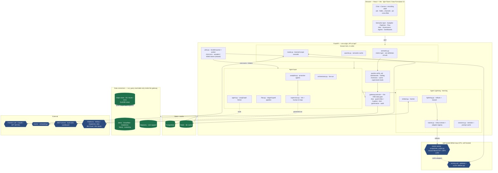

**One gate for data.** Every path that returns rows — the agent's `run_sql`
tool, the keyless fallback preview, canvas panels, a chat rerun, dashboard
tiles, catalog samples and suggestions, freshness probes, a semantic-cache
hit, a supervised read, and `queries.verify_sql` (the verified-SQL library, a
pipeline step, the flow's Validator, the semantic layer) — calls
`gateway.execute(user, source, sql, purpose)` (`gateway.py`), which applies
RBAC check → query guard → row limit → execution → governance compliance
filter → audit, in that fixed order and nowhere else. The `purpose` becomes
the `audit_log` action (`agent_sql`, `fallback_preview`, `canvas_compose`,
`rerun`, `dashboard_tile`, `catalog_sample`, `catalog_suggest`, `freshness`,
`cache_replay`, `supervised_read`, `verify`), so the activity feed says *why*
a read happened; a rejected or failed read is audited `ok=false`, and a read
whose audit row cannot be written never returns its rows. `gateway.check()`
validates without executing (dashboard pin time) and `gateway.scope()` returns
a source's connector plus the role-visible tables. There is no second way to
reach the warehouse: a connector's `run_query` raises `RuntimeError` outside
the gateway's scope at runtime, and `tests/test_gateway.py` fails the build on
any `.run_query(` under `app/` outside `gateway.py` — a permission can never be
skipped by taking a different route. Optional `STUDIO_QUERY_TIMEOUT_S` bounds a
single warehouse query; `STUDIO_MAX_ROWS` (read by `limits.py`) is the server
ceiling for any result.

**The allowlist is a namespace, not just a name.** RBAC keys on *bare* table
names, so an allowlist entry for `sales` also admitted `secret_schema.sales` —
and a warehouse credential almost always sees more schemas than the catalog
ever described. Every connector declares `qualifiers()`: the prefixes a table
reference may carry, built from the same environment it connects with and never
from a network call. `gateway.check()` hands that set to the guard, so
`check()` and `execute()` both refuse a cross-schema reference: *"Table
'secret_schema.sales' is outside the configured namespace for this source"*.
Matching is whole-**prefix** — matching only the *last* part would re-open the
same hole one database over, so `acme.public.sales` validates on a connector
configured for the `acme` database's `public` schema while
`other_db.public.sales` does not — and a same-named CTE can no longer launder a
qualified reference, because the engine resolves a qualified name to the base
table. Unqualified names are untouched: they are what RBAC keys on.

**Arity is part of the declaration.** One part and two parts are different
questions, because the vendors answer them differently, and declaring a name at
the wrong arity was itself a hole: with the database declared as a one-part
prefix, Snowflake read `ANALYTICS.sales` as the *schema* `ANALYTICS` — a
namespace the catalog had never described. Each connector declares each
spelling at the arity its own engine gives it, and the guard matches a whole
prefix at its own arity only:

| Source | One part | Two parts | Case of the declared prefix |
|---|---|---|---|
| PostgreSQL | `POSTGRES_SCHEMA` (a schema) | `dbname.schema` from the DSN | verbatim — the stored name |
| Snowflake | `SNOWFLAKE_SCHEMA` (a schema) | `database.schema` | folded **UP**, the name Snowflake stores |
| Databricks | `DATABRICKS_SCHEMA` (a schema) | `catalog.schema` | folded **down** (Spark folds everything) |
| BigQuery | `BIGQUERY_DATASET` | `project.dataset` | verbatim — BigQuery ids are case-**sensitive** |
| demo · object store · marketing · Neo4j | — | — | **empty**: a source that cannot vouch for a namespace accepts no qualifier at all |

**Identifiers are compared the way the engine resolves them.** `"CUSTOMERS"`
and `customers` are two different tables on PostgreSQL and Snowflake, and a
guard that lowercased both believed a quoted CTE was answering a bare
reference: with only `sales` allowed, `WITH "CUSTOMERS" AS (SELECT * FROM
sales) SELECT * FROM customers` bound a CTE named `CUSTOMERS` while the outer
reference resolved to the **denied base relation** `customers`. So the guard
keeps each identifier's *quotedness* and folds it per dialect — bare folds
**down** on PostgreSQL, **up** on Snowflake, not at all on BigQuery, and a
quoted name is exact on all three; every other engine we target (SQLite,
DuckDB, Spark/Databricks) is case-insensitive for quoted names too and keeps
the single case-insensitive reading. Allowlist entries and declared qualifiers
are read as *catalog* spellings — the name the engine stores — so both sides of
every comparison mean the same thing. Two consequences worth knowing: on
PostgreSQL and Snowflake, SQL that quotes a name in a case the catalog does not
use is now rejected (the engine would not have found that relation either), and
`POSTGRES_SCHEMA` / `SNOWFLAKE_SCHEMA` are read as *identifiers*, not free text
— see *Configuration*.

**An unqualified name can only mean the configured schema.** The guard cannot
check a bare name's namespace — there is nothing written to check — so the
PostgreSQL connector pins it on the connection instead: every connection is
opened with `options=-c search_path="<POSTGRES_SCHEMA>"` (a keyword argument,
which beats anything the DSN carries; double-quoted so the server does not fold
it). Without the pin, an allowlisted `sales` resolved to whichever schema came
first on the server's default `search_path`, which can be one the catalog never
listed. `POSTGRES_SCHEMA` must therefore be a plain identifier
(`[A-Za-z0-9_$]+`); anything else raises at connect time rather than being
pasted into libpq's option string.

**One gate, two dialects.** Neo4j speaks Cypher, where `MATCH (n:Person)
RETURN n` is the read shape and `SELECT` does not exist — so the SQL-only guard
rejected every valid graph query and the source was unusable. The fork is in
the **guard, never the execution path**: `gateway._guard()` picks
`cypherguard.py` when `connector.dialect == "cypher"` and `queryguard.py`
otherwise, and both expose `validate(text, allowed, qualifiers=…)` /
`enforce_limit(text, max_rows)`, raise the same `QueryRejected`, and return the
comment-free text the caller must execute. The SQL guard takes one argument
more — `dialect`, which decides how identifiers fold — because that question
exists on a warehouse and not in Cypher; `gateway.check()` therefore passes it
only to `queryguard`. RBAC, the row cap,
`governance.filter_result` and the audit row therefore run in the same order
for every source (see *Extending the agent* for what Cypher may say).

**Import layering.** `tests/test_layering.py` (an AST analysis, no third-party
deps) asserts that the module-level import graph of `backend/app` is a DAG and
that the leaf modules — `limits`, `policies`, `matching`, `queryguard`, `util`
(import nothing from the app), `sources` (→ `connectors`, the registry it
wraps) and `bootstrap` (→ `db`, lazily) — stay leaves. `grains.py` (the
time-grain vocabulary shared by the agent's keyless fallback and the pipeline
drafter) is written to the same rule — stdlib only, no `app` import — though it
is not yet named in the test's `LAYERS` map; `cypherguard.py` sits one step
above `queryguard` (its only app import, for the shared `QueryRejected`) and
below `gateway`, so it adds no cycle and needs no `LAYERS` entry. `policies.py`
holds the built-in RBAC dict; `rbac.py` resolves a role's policy through
`governance.policies()` with `POLICIES` as the fallback, so rbac sits *above*
governance and governance never imports rbac. `matching.py` holds the
deterministic prompt → table ranking so chat and pipelines can rank without
importing the catalog router (`rbac.POLICIES` and `catalog.match_tables`
remain as re-exports for one release; new code imports from `app.policies` /
`app.matching`). One lazy-import cycle is intentional and pinned
(`INTENTIONAL_LAZY_CYCLES`; the test fails if it grows or a new one appears):
`db ⇄ bootstrap` (db needs `demo_mode()`, bootstrap needs db only inside
`enforce()`), `db → extraction` (signup auto-onboards the user's M365
documents, best-effort) and `kag ⇄ extraction` (parser plug-in registration vs
ingestion). The other lazy imports — agent → router / trainer / kag / viz / mcp,
qcache and router → gateway, semantic → agent — are not cycles; they exist for
dormancy or optional dependencies.

### How a question becomes a chart

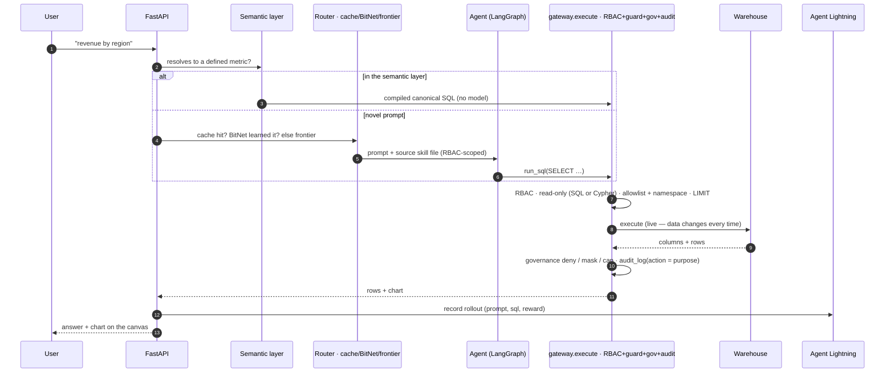

While a turn runs, the chat shows a **live activity feed** — the routing
tier taken, which named agent is running which SQL, charts being rendered,
fan-out and aggregation across sources — streamed by the worker running the
turn through the background-task row the UI already polls (`progress.py`), so
nothing new to deploy or open.

Without an API key the agent degrades to a deterministic preview
(`SELECT * … LIMIT` + auto chart), so the whole flow stays demoable. An
*invalid* key is a different case and is called out as one — "the server's key
was rejected; fix it or connect your own under ⚿ API keys" — instead of
pretending no key was set. A key you bring yourself (⚿ API keys) unlocks the
same model paths the server's key does — including multi-chart **canvas
composition**, which used to check only for a server key and left a BYOK user
in the single-chart editor.

---

## Semantic layer — one definition of truth

Left to itself, the agent writes SQL from scratch for every question. That makes
"revenue" a moving target: two phrasings of the same question can compile to
different SQL and return *different numbers*, and nobody can say how any figure
was computed. That's the classic self-serve-analytics failure — the numbers are
fast but untrustworthy.

The **semantic layer** (`semantic.py`) fixes it. An admin defines each metric and
dimension **once**, in YAML:

```yaml
models:
  - source: demo
    table: sales
    metrics:
      - name: revenue
        agg: sum
        expr: revenue
        synonyms: [sales, turnover, income, earnings]
    dimensions:
      - name: region
        expr: region
        synonyms: [geography, area, market, location]
      - name: month
        expr: order_date
        grain: month              # truncated per the source's SQL dialect
        synonyms: [over time, monthly, trend]
```

Now a chat turn tries the semantic layer **first** (a tier ahead of the cache,
the BitNet router, and the frontier agent). A deterministic resolver maps the
prompt to defined metrics/dimensions (whole-word + light-stem synonym matching —
it never *force-fits*), and a dialect-aware compiler produces the one canonical
SQL. `revenue by region`, `sales across geographies`, `turnover by market`, and
`income by location` all resolve to the same metric+dimension and compile to
**byte-identical SQL → identical numbers**. Anything the layer can't resolve
returns nothing and falls through to the agent, untouched.

Because it's deterministic it needs **no model at all** — the governed metrics
work with no API key, and can't drift. And it decides only *what* to compute:
the compiled SQL still goes through `queries.verify_sql` — a thin wrapper over
`gateway.execute(…, "verify")` — so **RBAC, the query guard, and governance
masking apply exactly as they do to any query**, and the run is audited. The
layer never widens access.

The answer is labelled **▣ Semantic layer** in chat and carries its own
definition note ("revenue = SUM(revenue) · by region"), so a number is never a
black box. Admins edit the YAML under **▣ Semantic layer**; everyone can browse
the metric catalog and type a prompt to preview the exact SQL it compiles to
(`POST /semantic/compile`, no execution) — the consistency guarantee, made
inspectable. The active model document is a DB fact, not a per-process one:
`models_for()` and `catalog()` re-check the newest applied model's
`(id, applied_at)` at most once per `STUDIO_SEMANTIC_REFRESH_S` (default 5 s)
per process and reload when it differs, so an edited definition reaches every
replica within that interval instead of leaving two workers compiling the same
metric from two different definitions.

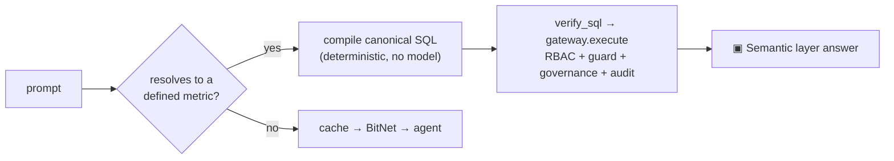

---

## The agent platform

### A named crew, not one model

Every connected source gets its own **worker agent**, briefed by an
auto-generated *skill file* (`skills.py`) that lists only the tables the current
user's role may touch. A cross-source question fans out to every accessible
worker and an **Aggregator** synthesizes their answers; a staged pipeline adds a
**Pipeline planner**, **Code generator**, **Validator**, **Approval agent**, and
a **Deployment executor**; the verified-SQL path is served by a **SQL verifier**.
`roster.py` gives each a stable name, so every answer reports which agent(s) ran
and each rollout is attributed to them.

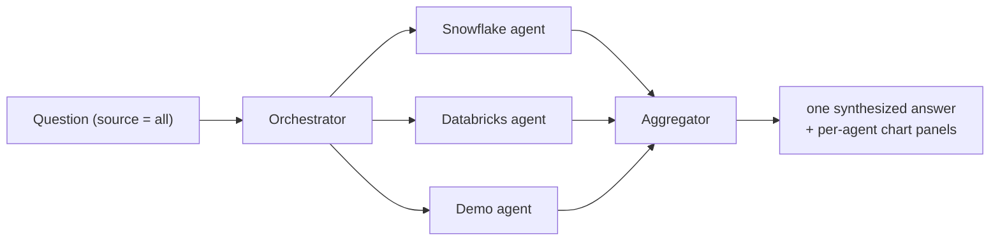

The skill file carries a fingerprint of `(dialect, allowed tables, schemas)` and
rebuilds itself the moment a schema or a role's access changes — the **Skill
files** view shows exactly what each agent knows.

### Verified SQL library

The agent writes SQL; a user can edit it, **verify** it (RBAC + guard + real
execution), and only then save it with the requirement prompt that produced it.
Verification is a hard gate — a query that doesn't run is never stored, and
re-running a saved query re-validates against the *runner's* role, so the
library can never become an RBAC bypass. `verify_sql` itself is a wrapper over
`gateway.execute` with purpose `verify`, so every verification — the verify
button, save / re-verify, a saved query's `/run`, and the internal callers in
blend, autopilot, flow, pipelines and the semantic layer — leaves a `verify`
row in the audit log (`ok=0` with the error on rejection or failure).

### Data freshness — "as of when"

Studio reads live data on every question, but it doesn't own the warehouse's
ingestion (dbt / Fivetran / Airflow do). It answers *"how current is this?"*
from what each table records about itself: `freshness.py` detects the best
freshness column — a load/ingest stamp (`loaded_at`, `snapshot_date`, `_ts`)
beats a business date, time-*typed* columns beat date-*named* ones (TEXT dates
are common) — and reads `MAX(col)` + row count through the gateway like
everything else (RBAC, guard and governance apply; the probe is deliberately
*not* audited, because a 30-table fan-out must not write 30 audit rows). Load stamps and record dates are labeled
distinctly: *when the pipeline last wrote* vs *the newest business date
present*. Surfaced three ways: a `data_freshness` agent tool (ask "as of when
is this data current?" in chat), a 🕒 button per source in the **Skill files**
panel, and `GET /freshness/{source}`. Honest limit: it reports what's *in* the
tables — a silently failed pipeline shows up as a freshness value that stops
advancing, not as a schedule alert.

### Prompt-built pipelines + data lineage

Describe a job; the **Pipeline planner** routes it to the source whose tables
best match, drafts an ordered set of steps, and can pick the right **GitHub
repo** (`repos.py`) whose scripts fit the prompt. Every drafted step is run
through `verify_sql` (RBAC + guard + real execution) before you see it, and the
response separates the two outcomes honestly: **`steps` holds only the steps
that verified** — possibly an empty list, still a `200` — and **`dropped` holds
every failure with its `error`**, which the UI renders as a "✗ failed: …" list
rather than badging a broken step "verified". Saving re-verifies server-side
under *your* role and rejects the whole pipeline on the first failure (a
client's `verified: true` is never trusted), so "saved" means "runnable"; more
than `MAX_STEPS` (6) steps is a `400`, never a silent truncation.

A step also carries **`intent_warnings`**. `grains.py` maps a prompt word to a
time grain (`monthly` → `month`) and to that dialect's bucket expression
(SQLite `strftime`, `DATE_TRUNC` elsewhere), so the deterministic drafter
buckets by the grain the prompt asked for and — in that bucketed shape —
aggregates the measure and groups by the dimension the prompt named; it also
skips a top-ranked table that holds no column the prompt mentioned. A prompt
with no grain in it keeps exactly the previous shape. When a drafted step
ignores a named grain — a "monthly" request answered by a daily aggregate — the
step is **kept and flagged** (`["does not bucket by month"]`, a ⚠ badge) rather
than dropped: it verified, it just may not be the question you asked, and only
you can judge that.

A pipeline renders a **source → table → step lineage diagram** (drawn from the
verified steps only) so a multi-source request shows exactly where each table
comes from; a failed step emails the requester naming the failing source/table,
and every run is traced through Agent Lightning.

### The staged flow — safe production behavior

`flow.py` turns one business request into a chain where **each stage is a named
agent that emits a typed JSON contract**, and each is recorded as a rollout:

```mermaid
flowchart TB
    req["Business request"] --> plan["Pipeline planner → PipelineSpec"]
    plan --> gen["Code generator → GeneratedArtifact"]
    gen --> val{"Validator → ValidationResult"}
    val -- fail --> rep["repair ×N"]
    rep --> val
    rep -- still failing --> hr["human review · STOP before approval"]
    val -- ok --> appr["Approval agent / human → DeploymentRequest"]
    appr -- reject --> pb["policy block (no bypass)"]
    appr -- ok --> dep{"Deploy the verified SQL steps<br/>(or a Spark payload of them)"}
    dep -- fail --> de["report error · do NOT bypass policy"]
    dep -- ok --> run{"Run"}
    run -- fail --> rt["platform retries"]
    rt -- still failing --> ro["stop · alert · rollback"]
    run -- ok --> ex["ExecutionResult · says what ran"]
    gen -. artifact syntax-checked only, never executed .-> ex
```

Read-only deployments run through; writes and Spark jobs hit the human-approval
gate. Deploy and Run are distinct phases — a deploy error is reported and never
bypasses policy; a run that keeps failing after the platform's retries is
stopped, the requester is alerted, and the deployment is rolled back
(best-effort, via an opt-in connector `rollback` hook).

**What actually gets deployed — and what does not.** The Code generator emits
Python, and it is tempting to read the green Validator tick as "the program
ran". It did not. The Validator only **parses** the artifact — the check is
named `python syntax (static only — not executed)` and sets
`ValidationResult.artifact_status = "syntax_checked_not_executed"` — because
**Studio never executes model-generated Python**. What the Approval agent hands
the executor is `DeploymentRequest.script`, built from the **verified SQL
steps** (or a Spark payload of them), carried on the request as
`deploys: "sql_steps" | "spark_job"` with `artifact_deployed: false`. So a run
whose artifact would raise on its first line is filed as
**`succeeded_sql_only`**, not `succeeded`, and one sentence written in a single
place (`flow.deployed_note`) says what ran — *"deployed the 3 verified SQL
steps; the generated Python artifact is a deliverable and was not executed
(syntax-checked only)"* — surfaced identically on `ExecutionResult.deployed`,
in the pipeline view, in the per-stage trace and in the digest email, so they
can never drift. The artifact is yours to take away and run wherever you run
code; Studio hands it over, it does not launch it. Routing it into a real
runtime is on the [roadmap](#future-rollouts), behind the same supervisor gate
as every other write.

**The Spark payload is a real Jobs submission, built by the connector.** The
flow used to hand-roll `{"tasks": [{"name": …, "sql": …}]}` — a shape the
Databricks API does not accept, so an approved `spark_job` deployment failed at
submit time, after the human gate. `databricks_conn.build_submission()` now owns
the Jobs 2.1 run-submit body: one `sql_task` per verified step, each with a
unique, API-legal `task_key` slugged from the step name (duplicates get a
numeric suffix — the API rejects a duplicate key, and silently merging two
steps would drop a verified statement) and the warehouse from
**`DATABRICKS_WAREHOUSE_ID`**. The statement rides inline as
`sql_task.query.query_text`; a workspace restricted to *saved* queries would
register the query first and substitute `query_id` in the same slot. With no
warehouse configured the flow **refuses before the supervisor is called** —
`decision: "reject"`, empty script, the reason naming the variable — rather than
building a body the API would `400`. `validate_submission()` runs both inside
the builder and again at the top of `submit_spark_job()`, before any HTTP call:
unique task keys, exactly one recognized task type per task, compute present
(`warehouse_id` inside a `sql_task`, `existing_cluster_id` / `new_cluster` /
`job_cluster_key` otherwise). Studio's private `output` key is stripped from
what is posted (`api_body()`) while the stored script keeps it for the bridge.

### Supervised execution + human-in-the-loop

Studio is read-only by default. Running a script or Spark job against a real
environment passes a **supervisor agent** (`supervisor.py`): read-only
statements auto-approve; writes, DDL, and jobs require a human (admin) to
approve before anything runs. Execution failures retry, then escalate — the
requester is emailed and an admin approves a retry or aborts. Studio *generates*
Python but never executes generated code in-process: running a script goes
through this gate, and approved tool-builder servers run only inside the
sandbox described under *Extending the agent*. Each `SELECT` / `WITH` statement
of an approved script is executed through the gateway as the requester
(audited `supervised_read`); the write / DDL branch stays outside the gateway
on purpose — its authority is the admin approval, and the gateway is the read
pipeline. A triggered **platform run** stays `running` until the live poll
(`GET /jobs/{id}/live`) sees the platform's genuine terminal state — trigger
success is not job success — and Spark / platform payloads are validated as
JSON at submit, so a malformed script is a clear 400 rather than a run-time
retry loop.

**One job kind is an approval record, not an execution.** A tool-builder
registration (`mcp_build`, `supervisor.ARTIFACT_KIND`) is Python, and it went
through the same `_execute` that hands a script to `connector.run_script` — so
an approved artifact job was one connector lookup away from running generated
Python against a warehouse, and `classify` was reading Python as SQL to decide
its risk. The kinds are named constants now (`SQL_KIND`, `SPARK_KIND`,
`PLATFORM_KIND`, `ARTIFACT_KIND`), `classify` returns its own risk
(`"artifact"`) without parsing the body as SQL, and `_execute` dispatches
**exhaustively**: the artifact branch runs before any connector is resolved,
records `{"executed": false, "approved_by": …}`, fails closed with no approver,
and **never touches a warehouse**; an unknown kind now *raises* instead of
falling through to `run_script`. The kind is not submittable over HTTP either —
only the tool builder mints one — and registration additionally requires the
linked job to *be* an artifact job.

### Governance-as-code

One YAML document (`governance.py`) owns per-role source/table access **and**
per-table compliance (deny columns, mask columns, row caps). Validate, then
apply — it hot-reloads with no redeploy, on every replica (below), and is
enforced inside the gateway on every result, so even `SELECT *` can't leak a
denied column. `deny_columns` also hide the column from schema metadata —
`/schema`, the source skill file, and suggestion prompts
(`governance.column_rules`) — while `mask_columns` stay listed and are masked
at result time; the catalog's auto-bar preview never
picks a masked column. A schema fingerprint change from a governance edit
naturally invalidates the suggestion cache. The same rules are re-applied to
stored chat rows at read time (see *Security model*). Clearing the document
reverts to built-in RBAC (`policies.py`).

**Applied once, enforced everywhere.** The active document is loaded into each
process and kept there — which used to mean a policy applied through
`PUT /api/governance` was enforced by the one process that served the request,
while every other web replica and the job worker went on applying the older,
more permissive rules indefinitely. Now every accessor that gates a decision —
`policies()`, `version()`, `_rules_for()`, `column_rules()`, `filter_result()`
and the admin `GET` — first calls `_refresh_if_stale()`, which reads the newest
applied document's `(id, applied_at)` from `governance_docs` at most once per
`STUDIO_GOVERNANCE_REFRESH_S` (default 5 s) per process and reloads `_STATE`
only when it differs. So a policy applied anywhere is enforced **fleet-wide
within one interval** — bounded, not zero: a replica may still apply the
previous document for up to that long, so set the variable to `0` to check on
every decision, or raise it when the store is remote. The cost is stated
plainly: one single-row indexed read per process per interval whether or not
anything changed, in exchange for convergence with no pub/sub and no sticky
routing. `version()` moves with the document, so the tile-cache key that
already carries it misses on stale replicas too, and `on_change` hooks still
fire in the process that reloads. Fail-closed behaviour is unchanged and
pinned by tests: no document means built-in RBAC, a malformed stored document
means built-in RBAC (loaded once, not re-loaded every interval), and a store
that cannot be read keeps the document already in hand rather than falling
open. The `STUDIO_GOVERNANCE` **file** fallback is still only re-read on an
explicit reload, so editing it on disk still needs a restart or a
`PUT`/`DELETE`. The semantic layer's model document works the same way
(`STUDIO_SEMANTIC_REFRESH_S`).

**Fail-closed when lineage is unknowable.** Result-time filtering has to answer
"which output column came from `lifetime_value`?". For a plain projection
`governance._shape` maps every output column to the select-list item that
defined it (positionally, else by name) and strips or masks exactly that
column; a `SELECT *` is a known shape too. But when the statement hides the
answer — a **denied column referenced inside a derived table, a CTE, a set
operation, or a projection whose items cannot be mapped one-to-one onto the
returned columns** — the value could be in *any* column, so
`governance.filter_result` raises `QueryRejected` and the read is **refused
with the offending column named**, never returned on a guess. (A *masked*
column in that same unmappable shape is not refused: every value in the result
is masked instead, which is the same fail-closed direction without losing the
row count.) Callers that re-filter stored rows at read time catch the rejection
and hide the rows. The cost is honest: a legitimate query that mentions a
denied column inside a CTE is rejected until it is rewritten to select that
column at the top level or drop it.

### Extending the agent — MCP, Build Python, graph DBs

Register **MCP servers** (`mcp.py`) exposing your existing scripts or internal
tools and agents pick them up automatically. **Build Python** (`pybuild.py`)
drafts a module in the style of your existing scripts using that MCP context.
A **Neo4j / Cypher** connector (`graph_conn.py`) sits behind the same
interface — and, since the guard forked by dialect, behind the same gate.
`cypherguard.py` is written to `queryguard`'s discipline: rules run over
**tokens**, never regexes (so `//` and `/* */` cannot hide a write, `'CREATE'`
inside a string literal is not one, and `` `Delete` `` is a quoted name), and
the comment-free text it returns is the text the gateway executes — validating
one string and running another is the bug class both guards exist to prevent.
It accepts exactly **one read-only statement** (`MATCH` / `OPTIONAL MATCH` /
`WITH` / `UNWIND` / `RETURN` / `CALL`): a `;` anywhere is refused; every
mutating or administrative clause is refused by token wherever it appears
(`CREATE`, `MERGE`, `DELETE`, `DETACH`, `SET`, `REMOVE`, `DROP`, `FOREACH`,
`LOAD CSV`, `USE`, `SHOW`, `GRANT`, …); `apoc.*`, `dbms.*` and `gds.*` are
refused in any position, procedure or function (the surface is far too large to
vet call by call, and `apoc.cypher.doIt` writes from what looks like a
projection), leaving `CALL` only the read-only catalog procedures `db.labels`,
`db.relationshipTypes`, `db.propertyKeys` and `db.schema.*`. Node **labels are
this source's tables** — `list_tables()` is `CALL db.labels()` — so every label
in a pattern must be in the role's allowlist, and a node pattern carrying **no**
label is refused, because `MATCH (n) RETURN n` and the anonymous hop in
`(a:Person)-[]->(x)` read the whole graph; re-using a variable a labelled
pattern already bound is the one exemption. A top-level `RETURN` is required so
the row cap has a well-defined place, and a `LIMIT` is appended when the final
`RETURN` has none (a `LIMIT` on an intermediate `WITH` does not count).

**That exemption is answered in Cypher's own scope, not a statement-global
table.** Cypher throws names away, and a guard that did not throw them away too
kept vouching for a `Person` the engine no longer had — so with only `Person`
allowed, `MATCH (n:Person) WITH count(*) AS c MATCH (n) RETURN n` and
`MATCH (n:Person) RETURN n UNION MATCH (n) RETURN n` both read the whole graph
through a variable that was no longer pinned to anything. The guard now walks
clauses in order threading the same scope Cypher does: **`WITH` replaces** the
scope with exactly what it projects (`WITH *` carries it all through; an
aliased item never pins its alias), **`UNION` starts a new query part** with an
empty one, and a **`CALL {}` subquery starts empty** and sees only what its
importing `WITH` hands it (what its `RETURN` projects becomes visible after
it). `EXISTS {}` / `COUNT {}` / `COLLECT {}` import a copy and export nothing.
Out of scope, a bare `(n)` is a **fresh** binding over the whole graph and is
refused exactly like `MATCH (n)`.

**Every label a pattern can match must be named.** `:A|B`, `:A&B`, `:A:B` and
the parenthesised `:(A|B)` are each checked name by name. `:!A` and `:%` match
by *exclusion* — `(n:!Person)` is the whole graph minus one label — so they
name nothing an allowlist can approve and are refused outright. A **dynamic**
label or relationship type (`(s:$(row.kind))`) names whatever the expression
evaluates to at run time, which no check made before execution can bound, so it
is refused unless it is a **static string literal**: `:$("Person")` is recorded
as if written `:Person` and decided by the ordinary allowlist check, while
`:$(x)`, `:$param` and `:$("Per" + "son")` all fail closed.

**A pattern comprehension is a traversal, not a list.** `RETURN [ (a)-->(b) | b
]` is a `MATCH` wearing list brackets, and its brackets hid it twice over: its
node patterns were never visited (so it streamed the whole graph from a
projection), and every `:Label` inside a `[…]` was classified as a relationship
*type*, which this guard deliberately does not allowlist (so a denied label was
reachable from any `RETURN`, `WITH`, `WHERE`, `UNWIND` or `ORDER BY`). Only a
bracket that follows a `-` opens a relationship; every other one is a list, and
a list holding a pattern is checked as the pattern it is. Ordinary lists,
indexes, slices, list comprehensions and arithmetic are untouched.
Governance needs no special case: `filter_result` keys on **column** names, so
the returned aliases are denied or masked exactly as on a SQL source, and a
statement whose lineage cannot be attributed falls back to every governed table
of that source. Known boundary, stated plainly: relationship **types**
(`[r:KNOWS]`) are not allowlisted — RBAC for this source knows only node
labels, which is all `list_tables()` can enumerate — so what bounds a traversal
is that the nodes at both ends of every hop must be allowed labels.

Approved **tool-builder** servers (`toolbuilder.py` — model-generated code,
human-approved) never run as a bare interpreter. At load time `mcp.registered()`
swaps each owner-scoped row for `sandbox.launch_spec()`, chosen by
`STUDIO_TOOL_RUNNER`: **process** (default) launches
`python -I -u app/sandbox_runner.py <server>` with a minimal explicit
environment (`PATH`, `HOME`=sandbox, `LANG`, the `STUDIO_TOOL_*` limits —
nothing else from the app's env; a credential reaches a tool only when named in
`STUDIO_TOOL_ENV_ALLOW`), CPU / memory / file-size / open-file rlimits, a
wall-clock watchdog (`STUDIO_TOOL_MAX_SECONDS`, exit 124), cwd = the
sandbox dir, umask 077, and a realpath check that refuses any file outside the
sandbox. **docker** runs the same file inside the `studio-toolrunner` image
(`docker build -f scripts/Dockerfile.toolrunner -t studio-toolrunner:latest scripts/`)
with `--network none` (override with `STUDIO_TOOL_NETWORK`), a read-only root
FS, tmpfs `/tmp`, memory / cpu / pids caps, all capabilities dropped, non-root,
and only that one server file mounted read-only. There is deliberately **no
`RLIMIT_NPROC`**: unlike every other limit it is scoped to the real *uid*, not
the process, so in process mode it would count and constrain the app's own
uvicorn workers and job threads — either denying the tool a `fork()` outright or
being too loose to matter. The real per-tool process cap is the docker runner's
`--pids-limit`, which is namespaced to the container. The process runner stops
accidents and runaway resource use but shares the host's uid, filesystem and
network; full isolation (no host files, no network unless allowed) requires
`STUDIO_TOOL_RUNNER=docker`. The runner is decided from the environment at load
time, never frozen into the DB at approval, and an unknown runner name or a row
pointing outside the sandbox is skipped with a warning — never a silent
downgrade.

**Production refuses the in-process runner.** Because the runner is read from
the environment at load time, a deployment that simply never set
`STUDIO_TOOL_RUNNER` would find out it had the weaker isolation only when an
agent first loaded a built tool. So `bootstrap.enforce()` **fails the boot** in
production mode (the default) when the runner is unset or `process` while built
tools can still be registered, with a `RuntimeError` naming the three ways out:
`STUDIO_TOOL_RUNNER=docker` — real isolation, and **the production setting**;
`STUDIO_TOOLBUILDER=0`, which disables built tools entirely
(`mcp.register_stdio()` refuses an owner-scoped registration and
`mcp.registered()` stops loading the ones already stored); or
`STUDIO_TOOL_RUNNER_ALLOW_PROCESS=1`, the explicit *"I accept that approved
generated code runs with the app's own filesystem, network and credentials"*,
which boots with a `WARNING` instead of raising. Defence in depth, because
launch specs are built long after the boot gate: under the same condition
`sandbox.launch_spec()` raises rather than returning a process spec, so
`mcp.registered()` skips that row with its existing warning — a refusal is
never a silent downgrade. Demo mode (`STUDIO_DEMO_MODE=1`) is untouched: the
process runner stays the laptop default.

---

## Knowledge (KAG) — your documents, RBAC-scoped

Numbers answer "how many"; documents answer "why" and "which one". **KAG**
(`kag.py`) grounds the agent in your own files — Excel, CSV, PDF, Word,
PowerPoint, and email — as *quoted, cited reference*, never as instructions it can
act on. A `knowledge_search` tool retrieves the most relevant passages (Harrier
embeddings + cosine, lexical Jaccard fallback when `HARRIER_EMBED_URL` is unset),
and every grounded answer shows **citation chips** naming the source document (and
page / sheet) it stood on.

- **RBAC on retrieval, server-side.** A collection carries an `access_scope`
  denormalized onto every chunk; the same scope test gates the tool, the
  `/kag/search` route, and which collections a role can even see — a role never
  learns another scope's knowledge base exists.
- **Private documents are owner-only.** Per-user documents (the M365 layer below)
  are ingested under a private `u:{user}` scope; retrieval is **identity-gated
  even for admins** — Studio's role hierarchy is not the authority, the source ACL
  is. An unresolved ACL fails closed (the item is never ingested).
- **Selectable as an engine.** When your role can reach a collection with content,
  `📄 KAG — your documents` appears in the composer's model menu; choosing it runs
  a documents-first turn that grounds in your files before touching the warehouse.

### Microsoft 365 extraction layer

The knowledge base fills itself. On signup, Studio **auto-onboards** a user's own
Microsoft 365 documents (OneDrive / SharePoint files + Outlook mail) into a
private, ACL-scoped KAG collection, then keeps it fresh — no manual upload.

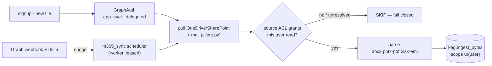

- **Auth abstraction, both models.** One `GraphAuth` interface, two interchangeable
  impls — **app-level** (application permissions, tenant-wide, admin-consented) and
  **delegated** (per-user OAuth with silent refresh). Sync code is impl-agnostic.
- **ACL → scope, fail-closed.** Each item's Microsoft permissions are resolved
  against the user's principal set; a document is ingested at the private scope
  only when the source actually grants that user read — otherwise it is skipped,
  never ingested at a wider scope.
- **Continuous, agent-run sync.** Graph **delta** queries + **change-notification
  webhooks** (registered at `$STUDIO_PUBLIC_URL/api/m365/webhook`) drive
  incremental updates on the worker's lease-guarded `m365_sync` scheduler
  (`STUDIO_GRAPH_TICK_SECONDS`; the webhook does no Graph I/O — it validates a
  constant-time `clientState` and only nudges the next run); changed files
  replace their prior version, tombstoned files are deleted.
- **Tokens encrypted at rest.** Access / refresh tokens are Fernet-encrypted
  (domain-separated key), never logged, never returned in any response, and fail
  closed on a rotated secret.
- **Dormant until configured.** With no `AZURE_*` env the whole layer is inert —
  routes return `{"configured": false}`, the scheduler never takes its lease, no
  Graph call is made, and imports never fail. Set the Azure app-registration
  vars to activate it (the sync ticker is then on unless
  `STUDIO_GRAPH_SYNC_TICKER=0`); the delegated OAuth return is
  `STUDIO_GRAPH_REDIRECT_URI`, default `http://localhost:8000/api/m365/oauth/callback`.

---

## Agent Lightning — the learning loop

Modeled on Microsoft's [Agent Lightning](https://github.com/microsoft/agent-lightning):
every run becomes a **rollout** (prompt → actions → outcome) with a **reward**,
persisted to the `agent_traces` table.

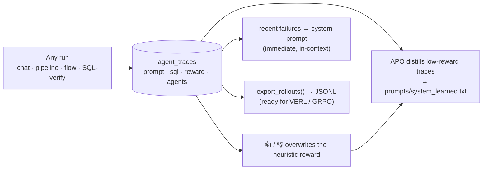

**Is it reinforcement learning?** Yes in structure, no in the usual sense. The
rollout + reward machinery *is* RL. But Studio runs on hosted models (Claude /
GPT) whose weights are frozen, so it can't do gradient/weight RL. Instead it
optimizes the **prompt** — recent failures injected in-context (immediate) and
APO distilling low-reward traces offline (RLAIF-style). The traces export in the
exact shape a real RL trainer consumes, so the day a self-hosted open-weight
model is added, the same rewarded data drives true weight RL — nothing about
collection changes.

**Per-agent reward shaping.** Each named agent is scored on its *own* decision,
not a blended answer-level reward: a worker on grounded SQL + rows + a real
chart, the aggregator on genuine synthesis, each flow stage on its own artifact,
the SQL verifier on whether its check ran. So the orchestrated crew produces a
per-worker rollout plus an aggregator rollout, and the `/learning` tally counts
only single-agent rollouts — no agent's average is smeared by another's work.
Each agent's reward + rollout count shows on its card in the **Agents** panel.

**Train our own model.** `GET /training` reports prompts collected vs. a
threshold, reward-labeled and human-rated counts, and readiness; the admin
**Agents** panel shows the progress bar. `POST /training/export` writes the
rollout JSONL — the bridge to the self-hosted BitNet path below.

---

## Self-hosted BitNet — learned-scope routing + simultaneous training

The frontier LLM (Claude / GPT) is the *frontier of what's new*; recurring,
learned work moves to a cheap, self-hosted **BitNet** whose **scope grows** over
time. Every prompt routes in three tiers, all keyed on *meaning* via Harrier:

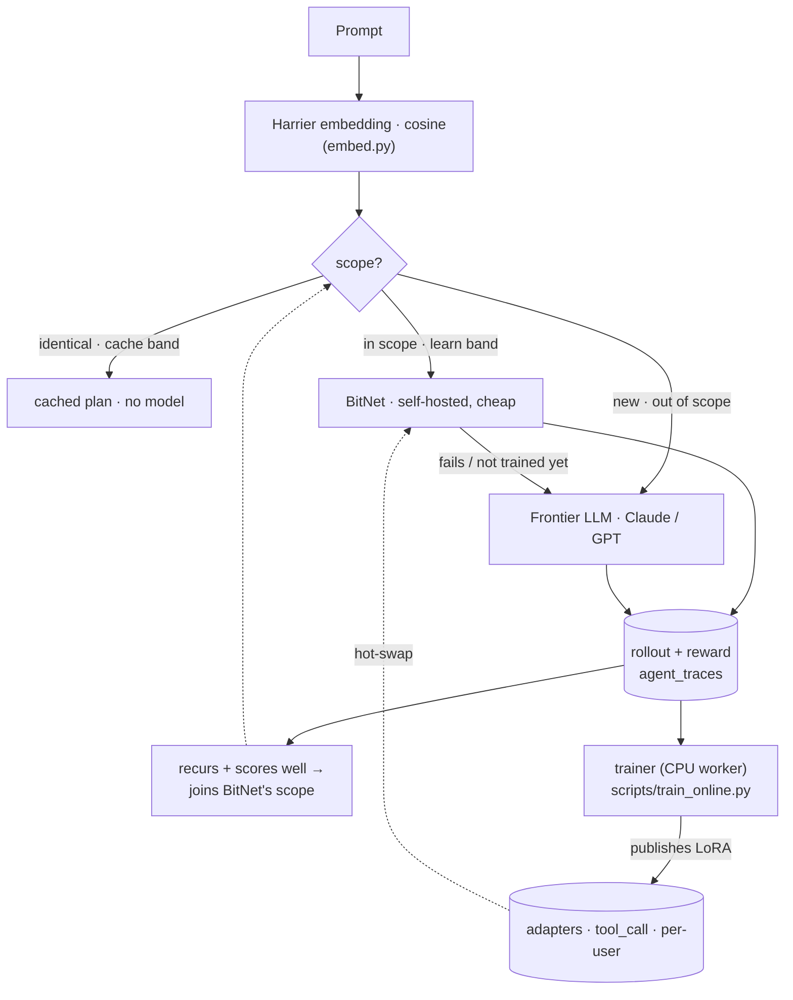

- **The scope grows, frontier usage shrinks.** A new prompt goes to the frontier
  LLM; its successful answers accumulate until that use case is *learned*
  (recurs, scores well) and joins BitNet's scope — future variations then route
  to BitNet, and only genuinely new contexts reach the frontier (`router.py`).
- **Harrier defines "same meaning."** `embed.py` embeds prompts with
  `microsoft/harrier-oss-v1-0.6b` (1024-dim, instruction-prefixed queries,
  documents plain) and scores cosine similarity — so different-word paraphrases
  match. It falls back to lexical token-Jaccard when `HARRIER_EMBED_URL` is unset.
- **Centralized + access-gated.** The learned scope is shared across users —
  one user's repeated, successful patterns benefit everyone (seen/reward
  aggregate across roles) — but a requester routes to BitNet only when their role
  can access every table the pattern touches ("same access"). **RBAC governs data
  access regardless of which model decides**; BitNet's SQL passes the same guard.
- **Safe through the training lag.** If BitNet hasn't actually trained on a
  just-learned case yet, its attempt fails and *escalates to the frontier* —
  cheaper, never wrong.

**Pick the engine directly.** Automatic tiering is the default, but the
composer's model menu also surfaces the self-hosted BitNet (`🧠 BitNet — learned`)
and your knowledge base (`📄 KAG — your documents`) as explicit choices whenever
each is usable — choosing BitNet forces the learned engine, choosing KAG runs a
documents-first turn (see **Knowledge** above). Each appears only when it can
actually serve, so no user learns another scope's engine or knowledge base exists.

**Simultaneous training** (`trainer.py` + `scripts/train_online.py`). Studio is
the concurrent **producer + adapter server**; a **CPU worker** is the trainer —
BitNet's 1-bit base is CPU-efficient and its LoRA adapters are small, so **no GPU
is required**. They run at the same time:

```
Studio agent ──rollouts──▶  trainer (CPU worker)  ──adapters──▶  Studio serving
  (produces)                (SFT → DPO → GRPO)                   (hot-swaps)
     ▲                                                                │
     └──────────────────── keeps serving with the newest ────────────┘
```

The trainer pulls reward-labeled rollouts (`GET /training/rollouts`), trains a
**global tool-calling** LoRA plus **per-user style** LoRAs, and publishes them
(`POST /training/adapters`); serving composes both per request and hot-swaps to
the newest version. `GET /training/online` reports the loop status and BitNet's
growing scope. The heavy ML deps live in `scripts/requirements-trainer.txt`
(kept out of the lean API image); run the worker via `scripts/Dockerfile.trainer`.
The whole path is **dormant until `STUDIO_LLM_BASE_URL` (BitNet) and
`HARRIER_EMBED_URL` (Harrier) are configured**, so it changes nothing on its own.

---

## Performance

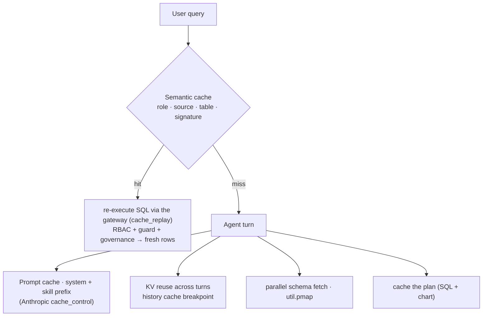

- **Independent I/O runs in parallel** (`util.pmap`) — per-source `list_tables`
  + schema fetches in the orchestrator, pipelines, and whole-source chat load
  concurrently, so latency is the slowest source, not their sum. (Agent tools
  stay sequential — they share the turn's context by design; the orchestrator
  fans agents out in parallel instead.)
- **Prompt caching** marks the large stable system/skill prefix with an
  Anthropic cache breakpoint — the provider keeps its KV cache warm and bills
  reads at ~10%. The prompt is laid out *stable content first, volatile content
  last*: role, skill file, learned rules, and rules form the cached prefix;
  the user's memory notes and the source's recent failures ride in a second
  block **after** the breakpoint, so a `remember` call or someone else's failed
  query on the same source can't invalidate everyone's cached prefix.
- **KV reuse across conversation turns** marks the last prior-turn message with
  a second breakpoint, so each turn reuses the whole system + history prefix.
- **Semantic query cache** (`qcache.py`) caches a successful run's plan under a
  signature; a semantically-similar prompt reuses it but **always re-executes the
  SQL** through the gateway (audited as `cache_replay`) — fresh rows, access
  re-checked, never stale and never a bypass. Similarity uses Harrier embeddings when configured,
  lexical Jaccard otherwise (see the BitNet section).
- **Model cascade** (`router.py`) — learned, recurring work is served by the
  cheap self-hosted BitNet instead of the frontier LLM; only new use cases pay
  for the frontier. Full treatment in the [BitNet section](#self-hosted-bitnet--learned-scope-routing--simultaneous-training).

`usage` on each answer (input/output + cache-read/write tokens) makes the reuse
measurable.

---

## Sessions & concurrent tasks

- **Serialized agent sessions** (`sessions.py`) — every conversation is
  snapshotted with its model, scope, full transcript, and a hashed cacheable
  prefix, so a run can be paused, **resumed**, or **forked**; token + cache-read
  meters show the reuse.
- **Background tasks + blue dot** — `POST /chat/background` records the user
  turn, then writes the `chat_tasks` row **and** its `chat_turn` job in the
  durable `background_jobs` table (`jobs.py`) in **one transaction on one
  connection** (`jobs.enqueue(..., conn=c)` enlists in the caller's transaction
  instead of committing its own), and returns `202` immediately, so
  you can start a question in one chat, switch to another and start a different
  one, and a **blue dot** lights up each conversation when its task finishes
  (cleared when opened). A worker claims the job with one atomic `UPDATE`
  (`FOR UPDATE SKIP LOCKED` on Postgres) that stamps a **per-claim token** into
  `locked_by`, heartbeats every 10 s while running, and records the outcome;
  a failed attempt is retried with backoff (5 s, 10 s,
  … capped at 5 min, `max_attempts=2`) and the last attempt marks the chat task
  failed. Every ~30 s `reclaim_stale` puts a running job whose heartbeat is
  older than `STUDIO_JOB_STALE_S` back on the queue, so a restarted or crashed
  worker never loses a turn. **Claims are fenced**, because "reclaimed" and
  "dead" are not the same thing: a worker that went quiet long enough to be
  reclaimed and then came back is still running its handler. `heartbeat`,
  `complete` and `fail` all take the claim token and match `AND locked_by = ?`,
  and `reclaim_stale` clears `locked_by` — which is what invalidates the old
  token, load-bearing rather than tidiness. So the stale worker cannot complete
  the job a second time, cannot fail it, cannot spend one of its attempts or
  re-queue it, and cannot keep the new owner's row looking alive: the first
  refused heartbeat stops its heartbeat thread with one log line, its result is
  discarded, and the reclaiming worker's run is the one that counts. That is
  what closes the double-execution path — a chat turn answered twice, a
  scheduler tick run twice. The handler is also re-entrant **by identity**: the
  task row records the id of the user message it answers
  (`chat_tasks.user_message_id`, migration 6) and the assistant message it
  produces is stamped with the same id (`content.reply_to`), so a redelivered
  job is recognised as already answered and just marked done. Matching on
  identity rather than "is there a newer assistant message?" is what lets two
  background turns run in the *same* conversation without either being mistaken
  for the other; task rows written before that column keep the old temporal
  test, so they stay retry-safe.
- **A turn cannot be answered twice, and a task cannot be left running with no
  job.** Both used to be possible, and neither was fixed by being careful.
  *Atomicity:* the task row and its job were two commits, so a failure between
  them left `chat_tasks.status='running'` with nothing behind it — the UI spun
  forever. One transaction means either both rows exist or neither does, and
  the job's id is derived from the task's (`chat_turn:<task id>`), so the two
  can be joined and a repeated enqueue for one task cannot queue the turn
  twice. The user message stays deliberately outside that transaction: an
  orphan there is an unanswered question the user can ask again, not a row that
  lies about work being in flight. *Uniqueness:* two attempts of the same
  reclaimed job really can run at the same instant — Python threads are not
  preemptible, so a cooperative abort is a courtesy, not a guarantee — and a
  check-then-insert guard loses that race. The guarantee is a **column with a
  unique index**: `messages.reply_to` (migration 7) with `CREATE UNIQUE INDEX …
  ON messages(reply_to) WHERE reply_to IS NOT NULL`, so the second `INSERT`
  simply cannot land. `db.add_message` recognises the violation structurally
  (SQLite `IntegrityError`, Postgres `SQLSTATE 23505`), rolls back so a pooled
  connection is never returned aborted, and returns `None`: *someone else
  answered, discard mine* is a normal outcome, never a `500`. The partial
  predicate keeps every other message — every user turn, every synchronous
  answer — unconstrained. The cooperative half is still there and still worth
  having: `jobs.check_claim()` raises `ClaimLost` the moment a heartbeat is
  refused, and `jobs._execute` treats that as **silent abandonment** — no
  complete, no fail, no retry, because the attempt now belongs to whoever owns
  the row.
- **Rows an older build stranded heal themselves.** `reclaim_stale()` runs
  registered `jobs.reconciler` functions on its existing pass, and chat's marks
  failed any task left `running` past `STUDIO_CHAT_TASK_ORPHAN_S` (default
  `max(3 × STUDIO_JOB_STALE_S, 900 s)`) whose job is missing or already
  finished. Generous on purpose: the cost of waiting is a spinner, the cost of
  being early is failing a turn that was about to answer.
- **One worker, N replicas** — the autopilot and Microsoft 365 tickers are no
  longer daemon threads. The worker's scheduler loop runs `autopilot.tick_once()`
  / `sync.tick_once()` on their cadence (`STUDIO_AUTOPILOT_TICK_SECONDS`,
  `STUDIO_GRAPH_TICK_SECONDS`) only while it holds the `autopilot` /
  `m365_sync` row in `scheduler_leases` (TTL 2× the interval), so several
  replicas never run several tickers; `STUDIO_AUTOPILOT_TICKER` /
  `STUDIO_GRAPH_SYNC_TICKER` keep their meaning (a disabled ticker skips its
  lease). A tick does **not** run inline in the poll loop: each scheduler gets
  one slot on a scheduler-only executor (a slow autopilot pass never delays the
  M365 pass, and a second tick of the *same* scheduler is refused rather than
  queued behind the first), and a side thread renews the lease for as long as
  the tick runs — a tick slower than its TTL used to lose the lease under
  itself and let a second replica start the same pass alongside it. A renewal
  that does not come back holding the lease is treated as **loss**: renewing
  stops at once (a later renewal would steal the name back from the new holder)
  and the tick's abort event is set. The TTL is `max(4 × interval, 120 s)`, and
  the bound that matters is failover: a live tick renews every 10 s, so the
  lease only expires after twelve consecutive failed renewals. `stop()` waits
  a bounded five seconds for an in-flight tick and then releases the leases of
  the ticks that **finished** — a tick still running keeps its lease and is
  logged, because releasing it under a live tick is precisely the overlap the
  lease exists to prevent (we cannot kill a daemon thread, so handing the name
  to another replica starts a second copy of the same pass alongside it).
  Leaving it costs at most one TTL of no ticking; releasing it costs
  correctness.
  `STUDIO_WORKER_MODE` picks where jobs run: `thread` (default) runs one
  worker inside the web process — the single-service behaviour, with chat jobs
  shared across replicas by atomic claims; `external` makes the web process
  enqueue only and `python -m app.worker` run them; `off` runs nothing (tests).
  The standalone worker closes the Postgres pool on clean shutdown, so `SIGTERM`
  to exit is prompt rather than lingering on the pool's maintenance threads.
- **Refresh-proof UI** — a browser refresh restores the open conversation (with
  its charts, and a still-running task's live state) and any unsent composer
  draft, both kept per user. History itself always lives server-side in
  Postgres — the refresh only ever risked the *view*, and now not even that.
- **Live agent activity** — while a background turn runs, the thinking bubble
  narrates it: routing tier, `snowflake agent: running SQL — SELECT …`,
  chart rendering, fan-out / aggregation. Steps are appended to the task row
  (`chat_tasks.steps`, capped) by `progress.py` from the worker running the
  turn and returned by the same `GET /tasks/{id}` poll; reopening a chat
  mid-run picks the feed back up.
- **Chat folders** — personal, per-user organization of the sidebar: create /
  rename / delete folders, file a chat via its right-click menu, collapsible
  groups with running / unseen indicators. Filing is owner-only and never
  visible to share recipients; deleting a folder unfiles its chats, never
  deletes them; names are unique per user (case-insensitive).
- **Discoverable renaming** — chats and folders show a ✎ on hover and rename on
  double-click (IME-safe inputs); the tool pages collapse into one
  "Tools & settings" group so the chat list always has room.

---

## Visualization

22 chart types across three engines (ECharts default, Plotly, Vega-Lite), with a
data-shape fit check that hides types the current result can't support. A single
prompt drives the full **chart spec v2** — one merge patch over data *and* pixels:

| Layer | Where | What |
|---|---|---|
| `transform` | the `app/viz/` package (`transform.py` + `stages.py`), server-side | calculated fields (sandboxed AST — no `eval`), table calcs (% of total, running total, rank, period-over-period, moving average), binning, date truncation, top-N with an "Other" bucket, filters, grouping |
| `format` | `format.js`, client-side | number/date/currency/percent formats, data labels, axis titles, legend, palettes, reference/target lines, conditional colours |

Stages run in a fixed order — `derive → bin → filters → unpivot → group → having
→ table_calc → top_n → sort → pivot → limit` — so the model emits *what*, never
*when*. **Multiple charts from one sentence**: each panel may carry its own
`SELECT`, so a finer grain the current result aggregated away is re-queried
through the same guard. **Cross-filtering** is a server-side predicate applied to
every tile — no JS mirror, so filtering means the same thing everywhere.
**Live cell edits update charts in place** — the ECharts instance persists
across data changes, so an edit moves one value instead of re-running the
entrance animation on the whole chart.

---

## Data architecture

State lives in **PostgreSQL** when `DATABASE_URL` is set, otherwise SQLite.
`db.py` wraps psycopg in a SQLite-shaped facade, so every statement is written
once and runs on both. On Postgres, `db._conn()` borrows from a process-wide
`psycopg_pool` (min 1, max `STUDIO_PG_POOL_SIZE`, waits up to
`STUDIO_PG_POOL_TIMEOUT` seconds for a free connection); `close()` returns the
connection and rolls back anything left open. If `psycopg_pool` is not
installed the app falls back to one direct connection per call and logs a
single warning. `/health` reports `db_pool` gauges (`null` on SQLite or before
first use).

```mermaid
erDiagram
    users ||--o{ conversations : owns
    users ||--o{ dashboards : owns
    users ||--o{ agent_traces : scores
    users ||--o{ agent_sessions : serializes
    users ||--o{ chat_tasks : "runs in background"
    conversations ||--o{ messages : contains
    conversations ||--o{ conversation_shares : "shared via"
    dashboards ||--o{ dashboard_tiles : contains
    users ||--o{ pipelines : builds
    pipelines ||--o{ pipeline_runs : "traced by"
    users ||--o{ saved_queries : verifies
    users ||--o{ flow_runs : "runs staged flow"
    users ||--o{ supervised_jobs : submits
    users ||--o{ query_cache : "semantic cache"
    users ||--o{ background_jobs : enqueues

    users {
        text id PK
        text email UK
        text role
    }
    messages {
        text id PK
        text content "JSON: text, sql, rows, chart, author_role"
    }
    dashboard_tiles {
        text id PK
        text sql
        text spec "chart spec v2"
    }
    agent_traces {
        text id PK
        double reward
        text reward_source
        text meta "agents, artifact"
    }
    agent_sessions {
        text id PK
        text messages
        text prefix_hash
        int cache_read_tokens
    }
    flow_runs {
        text id PK
        text spec
        text validation
        text deployment
        text execution
    }
    query_cache {
        text signature
        int seen
        double avg_reward
        text embedding "Harrier vector"
    }
    training_adapters {
        text id PK
        text scope "global | user_id"
        text kind "tool_call | user_style"
        int version
    }
    background_jobs {
        text id PK
        text kind "chat_turn"
        text status "queued | running | done | failed"
        int attempts
        double heartbeat_at
    }
    schema_migrations {
        int version PK
        text name
        double applied_at
    }
```

Alongside these: `governance_docs`, `mcp_servers`, `github_repos`, `chat_tasks`,
`training_adapters`, `scheduler_leases` — each a small table with a TEXT-uuid
primary key (Postgres has no implicit autoincrement, and a `REAL` epoch would
round; the facade maps `REAL → DOUBLE PRECISION`). `query_cache` doubles as
the semantic cache and BitNet's learned-scope repertoire (repetition + reward +
Harrier embedding). `background_jobs` is the durable job queue and
`scheduler_leases` makes the periodic tickers single-instance (see *Sessions &
concurrent tasks*).

**Schema migrations.** The `CREATE TABLE IF NOT EXISTS` baseline in
`init_db()` / each module's `init_tables()` is the complete schema for a fresh
database. `app/migrations.py` holds numbered, idempotent, dialect-aware
migrations (currently 1–6: `users.verified`, `conversations.folder_id`,
`chat_tasks.steps`, `mcp_servers.owner_id`, `query_cache.seen` /
`avg_reward` / `embedding`, `chat_tasks.user_message_id`) recorded in
`schema_migrations`
(`version`, `name`, `applied_at`) and run after the last `init_tables()` at
startup, each in its own transaction; a migration never creates a table.
`apply_pending()` is **serialized across replicas**, so web and worker booting
at the same moment on the first start after an upgrade is safe: a process-local
mutex covers threads, Postgres takes a session-level `pg_advisory_lock` on a
fixed key (released in a `finally`), and SQLite opens `BEGIN IMMEDIATE` with a
30 s `busy_timeout` so the second replica *waits* for the write lock instead of
dying mid-migration. The applied set is re-read once the lock is held, so the
loser applies nothing and returns an empty list rather than crashing, and a
version another process committed in the remaining window is recognised as
applied and skipped. `python -m app.migrate up` racing a booting replica is
safe for the same reason. `STUDIO_AUTO_MIGRATE=1` (default) applies pending
migrations at boot;
`STUDIO_AUTO_MIGRATE=0` makes boot refuse (a `RuntimeError` listing the pending
versions) until `python -m app.migrate up` has been run. `python -m app.migrate
status` prints the store, the current version and the pending list — same env
as the server (`DATABASE_URL` / `STUDIO_DB_PATH`, loads `backend/.env`).

Warehouse connectors coerce every result cell to JSON-safe values
(`base.to_jsonable`: dates/times → ISO strings, `Decimal` → numbers so numeric
columns stay numeric for charts, bytes → text, nested structs recursed). Real
warehouses return Python objects SQLite never did, and both the API response
and the Redis tile-cache round-trip need plain JSON — this surfaced as a real
production bug the day Databricks was connected.

**Two deliberate choices:** dashboards and saved queries store the **recipe**
(SQL + spec), never rows, so RBAC is evaluated at *view* time; messages **do**
store rows (that is what makes a chat replayable), which is exactly why sharing
is an RBAC boundary enforced at read time. Stored rows need not live forever:
`STUDIO_MESSAGE_ROWS_RETENTION_DAYS` (default `0` = keep) strips `rows` and
`panels[*].rows` from assistant messages older than N days at startup
(`chat.purge_message_rows`), keeping text, SQL, chart and columns and setting
`content.rows_purged = true` so the UI can offer a rerun.

### Tile cache

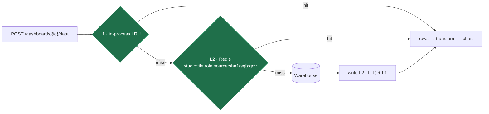

The key is **(role, source, `sha1(sql)`, governance version)**. The role is in
it, so two roles never share rows; the governance version is in it, so a policy
change is a **miss** — on every instance sharing the Redis, not only the one
that applied the edit — and the in-process L1 is cleared outright by a
`governance.on_change` hook. A cache hit is still re-checked with
`gateway.check()` **and** re-run through `governance.filter_result` on every
request — the cache only skips the warehouse round-trip and the audit row,
never a permission or compliance check. A miss
runs `gateway.execute(…, "dashboard_tile")` (one audit row per warehouse trip;
cached reads write none), capped at `min(STUDIO_DASH_TILE_ROWS, STUDIO_MAX_ROWS)`;
a `STUDIO_QUERY_TIMEOUT_S` expiry surfaces as a per-tile `source_error`, an
RBAC refusal as `forbidden`, a guard rejection as `query_rejected`. Redis is
optional and falls back to the in-process cache silently.

---

## Security model

- **One data gate** — every row-returning path calls `gateway.execute`,
  which runs RBAC → query guard → row limit → execution → governance → audit
  in a fixed order. Enforced twice: at runtime (a connector's `run_query`
  raises outside the gateway's scope) and statically (`tests/test_gateway.py`
  scans `app/` for any direct `.run_query(` or `unguarded()`).
- **RBAC** — roles (admin / analyst / viewer) map to sources and tables in
  `policies.py` (or the governance YAML, resolved by `rbac.py`), enforced in
  the catalog, the gateway, and the agent's schema context. A viewer cannot
  see `customers` (PII) at all; a forged catalog table name is a `400` and a
  well-formed name outside the role's allowlist an audited `403`.
- **Query guard, one per dialect** — one statement, read-only, a
  forbidden-keyword scan over tokens, the per-role allowlist and an enforced
  `LIMIT`: `queryguard.py` for SQL (`SELECT` / `WITH` only) and
  `cypherguard.py` for Cypher (`MATCH` … `RETURN`; no mutating or
  administrative clause, catalog procedures only, node labels allowlisted,
  unlabelled node patterns refused). The **guard** forks on
  `connector.dialect`; the execution path does not.
- **An identifier means what the engine says it means** — quotedness is kept
  and folding is per dialect (bare down on PostgreSQL, up on Snowflake, not at
  all on BigQuery, quoted exact on all three; case-insensitive everywhere
  else), and allowlist entries and declared qualifiers are read as the catalog
  spellings they are. Collapsing both readings to lower case let a quoted CTE
  stand in for a denied base table: `WITH "CUSTOMERS" AS (SELECT * FROM sales)
  SELECT * FROM customers` resolved the outer reference to the real
  `customers`.
- **A qualified name must stay inside the source's namespace** — the allowlist
  keys on *bare* table names, so the guard also checks any qualifier against
  the connector's own `qualifiers()`, built from the environment it connects
  with and declared **at the arity its engine gives it** (`schema`,
  `database.schema`, …; a whole prefix matches at its own arity or nothing
  does). `secret_schema.sales` is rejected — *"outside the configured namespace
  for this source"* — even though `sales` is allowed and the warehouse
  credential can see that schema, and a same-named CTE cannot launder it. A
  *bare* name carries no namespace to check, so the PostgreSQL connector pins
  `search_path` to the configured schema on every connection instead.
- **Cypher scope is Cypher's scope** — the "every node carries a label" test is
  answered against the variables in scope *where the pattern is written*:
  `WITH` replaces the scope, `UNION` starts an empty one, a `CALL {}` subquery
  sees only its importing `WITH`. Every label a pattern can match must be
  **named** — `:!A` and `:%` match by exclusion and are refused, a dynamic
  `:$(…)` label or relationship type is refused unless it is a static string
  literal — and a **pattern comprehension** in a projection is checked as the
  traversal it is, not skipped as a list.
- **Read-only by default** — writes / DDL / Spark jobs only run through the
  supervisor + human approval; Studio never executes generated code in-process.
  The supervisor dispatches on a **closed set** of job kinds and raises on an
  unknown one rather than falling through to `connector.run_script`, and the
  tool-builder kind (`mcp_build`) is an approval *record*: it is handled before
  any connector is resolved, records `executed: false`, and is not submittable
  over HTTP at all.
- **Generated Python is a deliverable, never a deployable** — the staged flow's
  Validator only *parses* the artifact (`python syntax (static only — not
  executed)`, `artifact_status = "syntax_checked_not_executed"`), and what the
  executor submits is `DeploymentRequest.script` — the **verified SQL steps**,
  or a Spark payload of them (`deploys`, with `artifact_deployed: false`). A run
  that produced an artifact is reported as `succeeded_sql_only` and every
  surface (pipeline view, stage trace, digest email) prints the same sentence
  naming what ran. Nothing in Studio ever executes model-generated Python;
  approved tool-builder MCP servers are the one code path that runs at all, and
  only inside the sandbox.
- **Built tools run sandboxed** — approved model-generated MCP servers launch
  only through `sandbox_runner` (path-confined, rlimits, watchdog, minimal
  explicit env — secrets reach a tool only via the `STUDIO_TOOL_ENV_ALLOW`
  allowlist) or, with `STUDIO_TOOL_RUNNER=docker`, inside a no-network,
  read-only, capability-dropped container. The runner is chosen at load time
  from the environment, so isolation is an operator setting, not something
  frozen into the DB at approval — and **production refuses to boot** on the
  in-process runner (unset or `process`) unless `STUDIO_TOOL_RUNNER=docker`,
  `STUDIO_TOOLBUILDER=0`, or the explicit `STUDIO_TOOL_RUNNER_ALLOW_PROCESS=1`
  opt-in is set. `sandbox.launch_spec()` refuses the process spec under the
  same condition, so getting past the boot gate only means the tool never
  loads, never that it loads less isolated.
- **Compliance filter, fail-closed** — governance strips denied columns, masks
  masked ones, and caps rows at every result exit — even `SELECT *` can't leak
  a denied field — and hides denied columns from schema metadata too. When the
  statement's lineage cannot be followed (a denied column referenced inside a
  derived table, CTE, set operation, or a projection that cannot be mapped
  one-to-one onto the returned columns) the read is **rejected with that column
  named**, not returned on a guess; a *masked* column in the same unmappable
  shape masks every value in the result instead. A policy applied on any
  replica is applied by **all** of them within `STUDIO_GOVERNANCE_REFRESH_S`
  (default 5 s) — the document's identity is a DB fact each process re-checks,
  not a per-process cache that only the process serving the `PUT` refreshed.
- **Private documents are owner-only** — Microsoft 365-ingested docs carry a
  per-user KAG scope; retrieval is identity-gated even for admins (the source ACL
  is the authority, not Studio's role), and an unresolved ACL fails closed.
- **Sharing is an RBAC boundary, re-validated at read time** — messages carry
  rows, so enforcement happens when messages are **read**, keyed off the
  *reader's* role (an owner gets no bypass). Messages are stamped server-side
  with the author's role and released only to a role at least as privileged;
  hidden ones return a 🔒 placeholder. The check is against the *live*
  governance document: a role tightened by YAML loses access to previously
  visible whole-source messages, a message's actual SQL (every base table,
  `queryguard.base_tables`) decides visibility rather than its table label, and
  later `deny_columns` / `mask_columns` rules are applied to stored rows for
  every reader, the owner included.
- **No credentials at boot** — production mode (the default) refuses to start
  without a strong `STUDIO_SECRET` (≥ 32 random characters, no placeholder),
  never seeds the demo accounts, and revokes the documented default password
  on any seeded account left over from an earlier version; the first real
  admin comes from `STUDIO_ADMIN_EMAIL` / `STUDIO_ADMIN_PASSWORD` or SSO.
  `STUDIO_DEMO_MODE=1` is the only way to get the demo logins.
- **Self-registration is closed in production** — `POST /api/auth/register` is
  gated on `bootstrap.open_registration()`: ON in demo mode, OFF in production,
  either way overridable with `STUDIO_OPEN_REGISTRATION`. Closed, it answers
  `403` and accounts come only from SSO or `STUDIO_ADMIN_EMAIL`. Open, it takes
  a 10+ character password, creates the account **unverified**, and returns
  **no token** — the emailed 6-digit code is the gate, not decoration. Until
  `POST /api/auth/verify-email` accepts it, `/auth/login` *and* every
  authenticated request answer `403 Verify your email before signing in`
  (re-checked on every request, so a token minted by an older build cannot
  outlive the gate). SSO / Entra users are provisioned verified and never see
  it.
- **`STUDIO_ADMIN_EMAIL` cannot be used to steal an account** — if the address
  already belongs to an account, it is promoted only when the operator can
  prove control: the account is SSO-provisioned (no usable local password) or
  `STUDIO_ADMIN_PASSWORD` verifies against its stored hash. Otherwise boot
  **fails** with a `RuntimeError` naming the conflict rather than handing admin
  to whoever registered that address first. The stored password is never
  rewritten.
- **Single API surface** — every endpoint lives under `/api` exactly once, so
  a reverse proxy or auth gateway that protects `/api` covers all of them
  (`/health` stays unprefixed for the platform healthcheck).
- **No existence oracle** — a resource you cannot see returns **404, never 403**
  (`_own_or_404` everywhere), so the id space can't be probed.
- **Admin-only surfaces** — governance, the MCP + GitHub-repo registries, job
  approval, learning stats, and training readiness are all admin-gated.
- **Auth** — email/password JWT, plus an Entra ID seam (redirect flow + bearer
  validation against Microsoft's JWKS) converging on the same user + RBAC.
- **The SSO redirect carries no session** — the Entra callback used to hand the
  SPA its JWT in the URL, where it lands in browser history, the `Referer`
  header and every proxy log in between. It now parks the minted token under a
  random **single-use code** (`{FRONTEND_URL}/?sso_code=…`, 60-second TTL) that
  `POST /api/auth/sso/exchange` trades for `{access_token, user}` exactly once;
  the entry is popped *before* it is validated, so unknown, expired and
  replayed codes are indistinguishable `400`s. The SPA scrubs the code from the
  URL before spending it. `?sso_error=` is unchanged.

---

## Tradeoffs — why we chose this

| Decision | Why | Tradeoff accepted |
|---|---|---|
| **Hosted LLMs (Claude / GPT) via BYOK**, not self-hosted weights | No GPU fleet; users bring their own key; always the latest models | Can't do gradient/weight RL — learning is prompt-level |
| **Agent Lightning optimizes the prompt for hosted models; weights for BitNet** | Hosted weights are frozen (prompt-opt only); a self-hosted BitNet's *are* trainable from the same rollouts | Two learning modes to reason about — but the rollout data is identical |
| **BitNet serves the learned scope, frontier serves the new** (scope grows) | Recurring work shouldn't keep paying the frontier; the frontier bootstraps data and handles novelty | Runs two models; needs a BitNet + Harrier endpoint stood up; a training lag (covered by escalation) |
| **Learned scope centralized + access-gated** | One user's learned patterns benefit everyone with the same access | The *cache* tier stays role-scoped (it reuses stored insight text) — only the routing is centralized |
| **BitNet / LoRA trains on CPU** (no GPU) | 1-bit base + small adapters are CPU-feasible; deployable without a GPU fleet | Coarser (batch) cadence than a GPU; trainer's heavy deps live in a separate worker image |
| **Prompt/KV caching via provider `cache_control`** | Hosted APIs don't expose the raw attention KV cache | You cache the *prefix* (server-side, TTL-bound), not tensors |
| **Semantic cache re-executes the SQL** (never returns stored rows) | Fresh data + RBAC/guard/governance re-checked on every hit | A hit still pays the warehouse round-trip (but skips the LLM) |
| **Harrier embeddings when configured, lexical signature otherwise** | Real semantic match (different-word paraphrases) with Harrier; deterministic lexical fallback keeps it working offline with zero deps | Embeddings need a Harrier endpoint stood up; the lexical fallback misses different-word paraphrases |
| **Read-only by default; writes go through supervisor + a human** | An analytics tool must never silently mutate production | Every write is gated — latency and a human in the loop, by design |
| **Studio generates Python but never runs it in-process** | Arbitrary code execution is the blast radius to avoid | The staged flow deploys the verified SQL steps (or a Spark payload of them) and hands the artifact over as a deliverable — a run that produced one reads `succeeded_sql_only`, and actually running it takes the supervised Jobs path or an approved, sandboxed tool |
| **A pipeline draft returns only the steps that verified** | "Verified" has to mean it ran; a hopeful list is worse than an empty one | A prompt can legitimately come back with zero steps and a list of reasons, which the UI has to explain |
| **Fail the read when governance lineage is unknowable** | A denied column inside a CTE could surface in any output column — guessing is a leak | A legitimate query must be rewritten (select the column at the top level, or drop it) before it will run |
| **Process runner by default on a laptop, docker required in production** (built tools) | Zero extra infra on dev; production must not run approved generated code with the app's own credentials by omission | A production boot now *fails* until the operator picks `STUDIO_TOOL_RUNNER=docker`, `STUDIO_TOOLBUILDER=0`, or the explicit `STUDIO_TOOL_RUNNER_ALLOW_PROCESS=1`; the process runner still cannot cut off the network or hide host files, and `RLIMIT_AS` is not enforceable on macOS |
| **Dashboards/queries store the recipe, not rows** | RBAC evaluated at view time, not frozen at pin time | Every view re-runs SQL (mitigated by the tile cache) |
| **Messages store rows** (replayable chat) | A chat has to render its past answers | Sharing becomes an RBAC boundary enforced at read time |
| **404, never 403**, for unauthorized resources | The id space must not be an existence oracle | Slightly less "helpful" errors — intentional |
| **Typed JSON contracts between flow stages** (Pydantic) | Explicit agent boundaries; every stage serializable + traceable | More ceremony than passing raw dicts |
| **Fail-fast flow + repair loop → human review** | A bad artifact must never reach approval or deploy | A borderline case a smarter model could fix still goes to a human |
| **Parallelize independent I/O, keep agent tools sequential** | Tools share the turn's context (`run_sql → render_chart` order matters) | No intra-turn tool parallelism — the orchestrator fans out across agents instead |
| **One SQLite-shaped facade over Postgres** | Write each statement once; runs on dev and prod | The facade must patch dialect gaps (`REAL → DOUBLE`, uuid PKs) |
| **Per-database agent + auto skill file** | RBAC-scoped context — an agent only ever sees tables the role may touch | The skill file must rebuild on any schema/access change (fingerprinted) |
| **LangGraph provider-neutral ReAct** | Swap Claude ↔ GPT without touching the graph or tools | Bound to LangChain's abstractions |
| **Durable job queue on the app DB** (`background_jobs`), not a broker | No extra infra: SQLite or Postgres *is* the queue; jobs survive restarts (stale-heartbeat reclaim), claims are atomic (`FOR UPDATE SKIP LOCKED` on Postgres) and **fenced** by a per-claim token so a reclaimed job cannot be completed twice, and a separate worker service is optional | Polling (`STUDIO_JOB_POLL_S`) rather than push; throughput bounded by the DB — fine for chat turns and tickers, not a firehose |
| **Governance converges on a short TTL, not pub/sub** | A policy has to reach every replica, and adding Redis pub/sub or sticky routing to do it is infrastructure the rest of the design avoids | One tiny indexed read per process per `STUDIO_GOVERNANCE_REFRESH_S` whether or not anything changed, and a bounded window (default 5 s) in which a replica may still apply the previous document — set it to `0` to check on every decision |
| **A qualifier the connector did not declare is rejected** | The allowlist describes bare names in the namespace the catalog was built from; a credential almost always sees more | Legitimate fully-qualified SQL must use a spelling the connector declares, **at the arity it declares it** (`schema`, `database.schema`, …), sources with no namespace (demo, object store, marketing) reject *any* qualifier, and BigQuery's backtick-quoted full path still has to be written bare or dataset-qualified |
| **An identifier is folded the way its engine folds it** | `"CUSTOMERS"` and `customers` are different tables on PostgreSQL and Snowflake; treating them as one let a quoted CTE stand in for a denied base table | Hand-written SQL on those two sources that quotes a name in a case the catalog does not report is now refused (as the engine would have refused it), and `POSTGRES_SCHEMA` / `SNOWFLAKE_SCHEMA` must be spelled the way the catalog reports the namespace |
| **A pattern comprehension is checked as a traversal** | `RETURN [ (a)-->(b) \| b ]` reads the graph from a projection, and its brackets also hid every label inside them behind the relationship-type exemption | The bracket heuristic is narrow on purpose (contents must start with a node group and contain a real arrow), so an exotic list expression that happens to look like a pattern would be judged as one |
| **SSO hands the session over through a single-use code** | A token in a redirect URL survives in history, `Referer` and proxy logs | The code map is in-process (as `_SSO_STATES` already was), so a multi-replica deployment needs sticky sessions until both move into the app DB; the SPA pays one extra reload on the SSO path |
| **Versioned migrations, auto-applied at boot** | Schema changes are numbered, idempotent, recorded, and serialized across replicas (advisory lock on Postgres, `BEGIN IMMEDIATE` on SQLite) so two booting services cannot collide; `STUDIO_AUTO_MIGRATE=0` hands control to a release step | A migration never creates a table, so the previous version must have booted once before `migrate up` has anything to do |
| **Single Railway service** (API serves the built frontend; worker optional) | One origin, no CORS, one deploy, one healthcheck | Frontend and backend scale together; a second `python -m app.worker` service is needed to scale jobs independently |

---

## Deployment

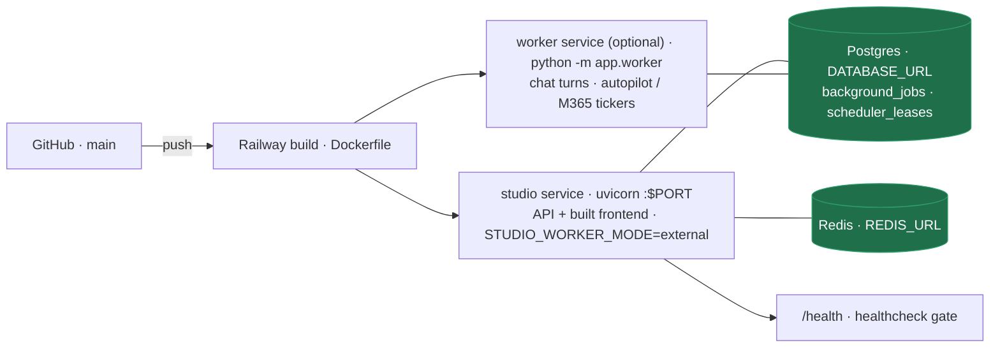

A two-stage Dockerfile builds the frontend with Node, then serves it from
FastAPI alongside the API — one service, one origin, no CORS in production.
`railway.json` gates each deploy on `/health`, which reports which backends are
live: `{ "store": "postgres", "tile_cache": "redis", "agent": "ready",
"db_pool": {…} }`.

- **Secrets.** `STUDIO_SECRET` is **required**: at least 32 random characters
  and not a placeholder, or the container refuses to start (the startup log
  names the missing or weak variable). Generate one with
  `python -c "import secrets; print(secrets.token_urlsafe(48))"`. It signs JWTs
  and derives the Fernet key for stored API keys and Microsoft 365 tokens, so
  rotating it logs everyone out and makes stored keys / tokens undecryptable
  (fail-closed). Never set `STUDIO_DEMO_MODE` in production.
- **First admin.** Set `STUDIO_ADMIN_EMAIL` (+ `STUDIO_ADMIN_PASSWORD`, ≥ 12
  characters, only needed until the account exists) or sign in through SSO;
  the demo accounts are not created in production. If that address **already
  has an account**, it is promoted to admin only when the account is
  SSO-provisioned (no local password) or `STUDIO_ADMIN_PASSWORD` matches its
  stored password — otherwise the boot **fails** with a `RuntimeError` naming
  the email and its current role. That refusal is the point: it means someone
  else owns that address, and silently promoting them would be the bug. Pick a
  different `STUDIO_ADMIN_EMAIL`, or reset that account and set
  `STUDIO_ADMIN_PASSWORD` to the new password.
- **Signups.** Self-registration is **off** in production. Leave it off and
  hand out accounts via SSO or `STUDIO_ADMIN_EMAIL`, or set
  `STUDIO_OPEN_REGISTRATION=1` to open it — new accounts are then created
  unverified and cannot sign in until the emailed 6-digit code is accepted, so
  configure SMTP (otherwise the message only lands in `backend/outbox/`).
- **Built tools.** A production boot **refuses** the in-process tool runner:
  set `STUDIO_TOOL_RUNNER=docker` (and build the image once —
  `docker build -f scripts/Dockerfile.toolrunner -t studio-toolrunner:latest scripts/`),
  or `STUDIO_TOOLBUILDER=0` if you do not want built tools at all, or
  `STUDIO_TOOL_RUNNER_ALLOW_PROCESS=1` to accept that approved generated code
  runs with the app's own filesystem, network and credentials (it boots with a
  `WARNING`). `docker` is the production setting.
- **SSO.** The Entra callback redirects to `{FRONTEND_URL}/?sso_code=<code>` —
  a single-use, 60-second code, never the token — which the SPA trades at
  `POST /api/auth/sso/exchange`. That map, like the OAuth state map, lives in
  the process that handled the callback, so behind more than one replica enable
  **sticky sessions** (or move both maps into the app DB) or the exchange can
  land on a replica that never saw the code and answer `400`.
- **Governance & semantic reload.** A document applied through the API reaches
  every web replica and the worker within `STUDIO_GOVERNANCE_REFRESH_S` /
  `STUDIO_SEMANTIC_REFRESH_S` (default 5 s each): every process re-checks the
  newest applied document's `(id, applied_at)` at most that often and reloads
  when it changed. The window is bounded, not zero — a replica may apply the
  previous document for up to one interval. `0` checks on every decision.
- **Worker.** `STUDIO_WORKER_MODE=thread` (default) runs the job worker inside
  the web process — the single-service deploy. To scale it separately, add a
  second service from the **same** Dockerfile with start command
  `python -m app.worker` (no `PORT` or healthcheck needed; it shares
  `DATABASE_URL` and every other variable) and set
  `STUDIO_WORKER_MODE=external` on the web service. Multiple worker replicas
  are safe. Both services run the same `init_state()` + migrations at boot, so
  keep `STUDIO_AUTO_MIGRATE` consistent across them.
- **Migrations.** With `STUDIO_AUTO_MIGRATE=0`, run `python -m app.migrate up`
  as a release step (after the previous version has booted at least once, so
  the baseline tables exist) before starting the new version. Either way the
  race is handled: `apply_pending()` serializes across processes (a Postgres
  advisory lock, `BEGIN IMMEDIATE` on SQLite), so web and worker starting
  together — or a release step overlapping a booting replica — applies each
  version exactly once and the loser exits cleanly having applied nothing.
- **URLs.** The API lives **only** under `/api` (`/api/auth/login`, `/api/chat`,
  `/api/m365/status`, …); `/docs` and `/openapi.json` show the real paths.
  Any non-`/api` path serves the built frontend's `index.html` (React Router:
  `/c/<id>`, `/dashboards/<id>`, `/jobs`, …) and `/assets` is served with
  caching, so a reverse proxy only needs to protect `/api`. `GET /health`
  remains unprefixed for the Railway healthcheck (`GET /api/health` is the
  canonical one). Azure app registrations must carry the `/api/…` redirect
  URIs: `AZURE_REDIRECT_URI` (default
  `http://localhost:8000/api/auth/azure/callback`) for SSO and
  `STUDIO_GRAPH_REDIRECT_URI` (default
  `http://localhost:8000/api/m365/oauth/callback`) for the Microsoft 365
  connector; Graph change notifications go to `$STUDIO_PUBLIC_URL/api/m365/webhook`.

**Upgrading an existing deployment.** Set `STUDIO_SECRET` (≥ 32 random chars)
before the next deploy or the container will refuse to start. On the first
production boot any `admin` / `analyst` / `viewer@studio.local` account still
using its documented default password has that password revoked (logged as a
`WARNING`); use `STUDIO_ADMIN_EMAIL` / `STUDIO_ADMIN_PASSWORD` or SSO to get an
admin back. Two boot behaviours changed and can bite an existing deployment,
both in the fail-safe direction: `STUDIO_ADMIN_EMAIL` pointing at an account
whose password `STUDIO_ADMIN_PASSWORD` does not match now **refuses the boot**
instead of promoting it (see *First admin*), and self-registration is now
**closed** in production — set `STUDIO_OPEN_REGISTRATION=1` if you were relying
on open signup. A third joins them: a production deploy that never set
`STUDIO_TOOL_RUNNER` (or set it to `process`) now **refuses to start** — pick
`docker`, `STUDIO_TOOLBUILDER=0`, or `STUDIO_TOOL_RUNNER_ALLOW_PROCESS=1`
before the next deploy. The SSO change needs no configuration (both halves ship
together), but an in-flight `?sso_token=` link minted by the old build no longer
signs anyone in — sign in again. Any live session belonging to a
self-registered, never-verified account stops working on upgrade; that account verifies its email and signs in
again. Update the Azure redirect URIs to the `/api/…` forms above — the
unprefixed twins now `404` — and reinstall requirements (`psycopg[binary,pool]`
adds the connection pool). Existing Graph subscriptions created with the old
webhook URL keep notifying the old path until they expire and are re-created at
the new one; sync degrades to delta polling meanwhile.

---

## Run it

### Backend
```bash
cd backend
python3.12 -m venv .venv && source .venv/bin/activate
pip install -r requirements.txt
cp .env.example .env            # add ANTHROPIC_API_KEY or OPENAI_API_KEY
export STUDIO_DEMO_MODE=1        # seeds the demo logins; without it the server
                                 # refuses to start unless STUDIO_SECRET is set
uvicorn app.main:app --reload --port 8000
```

Demo mode with no `STUDIO_SECRET` signs tokens with a random per-process
secret, so a backend restart logs everyone out — fine for a local demo, never
for production. Background jobs and the tickers run inside the web process
(`STUDIO_WORKER_MODE=thread`); `python -m app.worker` runs them separately.

### Frontend
```bash
cd frontend
npm install
npm run dev                      # http://localhost:5173 — the Vite proxy forwards
                                 # /api/* to http://localhost:8000/api/* unchanged
```

Or run it exactly as production does — `npm run build`, then start the backend
alone; FastAPI serves the built frontend on one origin, with an SPA fallback
so a refresh on a nested route still works.

Every surface has a URL — `/dashboards`, `/dashboards/<id>`, `/queries`,
`/pipelines`, `/governance`, `/semantic`, `/jobs`, `/py`, `/sessions`,
`/agents`, `/flow`, `/skills`, `/autopilot`, `/toolbuilder`, `/kag`, and
`/c/<conversation-id>` for a chat (`/` is a new chat; unknown paths redirect to
`/`) — bookmarkable, shareable, and the browser back button works between
them (React Router; the Vite dev server handles deep links itself).

### Demo logins

These accounts exist **only** when the backend runs with `STUDIO_DEMO_MODE=1`.
In production mode (the default) they are never created, and any that were
seeded by an earlier version have their default passwords revoked on the first
production boot. Demo mode also opens self-registration; in production the
Register form is hidden and `POST /api/auth/register` answers `403` unless
`STUDIO_OPEN_REGISTRATION=1`. When it is open, registering does **not** sign
you in: the account is created unverified and the emailed 6-digit code
(`backend/outbox/` without SMTP) must be entered before you can log in.

| Email | Password | Role | Sees |
|---|---|---|---|
| admin@studio.local | admin123 | admin | everything + governance, jobs, training |
| analyst@studio.local | analyst123 | analyst | everything (no admin surfaces) |
| viewer@studio.local | viewer123 | viewer | demo: sales, web_traffic only |

---

## Configuration

**Boot, auth & state store**

| Variable | Purpose |
|---|---|
| `DATABASE_URL` | Postgres; unset falls back to SQLite |
| `REDIS_URL` | Tile cache; unset falls back to in-process |
| `STUDIO_ADMIN_EMAIL` | Optional. The first real admin: created (role admin, email-verified) from `STUDIO_ADMIN_PASSWORD` if missing. If the address **already exists**, it is promoted only when the account is SSO-provisioned (no local password) or `STUDIO_ADMIN_PASSWORD` verifies against its stored hash — otherwise boot fails with a `RuntimeError` naming the conflict. The password is never rewritten. Works in both modes |
| `STUDIO_ADMIN_PASSWORD` | Required while `STUDIO_ADMIN_EMAIL` names a user that does not exist yet (≥ 12 characters or boot fails), and the proof of control that lets an existing password account be promoted. Can be removed after the first boot |
| `STUDIO_AUTO_MIGRATE` | `1` (default) applies pending schema migrations at boot; `0` never alters the schema at boot and refuses to start with pending migrations (run `python -m app.migrate up`) |
| `STUDIO_DB_PATH` | SQLite path — point at a mounted volume, or deploys wipe it |
| `STUDIO_DEMO_MODE` | `1` / `true` / `yes` enables demo mode: seeds the three demo accounts, opens self-registration, and, if `STUDIO_SECRET` is unset, signs tokens with a random per-process secret (sessions end on restart). Default unset = production mode. **Never set in production** |
| `STUDIO_OPEN_REGISTRATION` | Whether `POST /api/auth/register` may create an account. `1` / `true` / `yes` opens it, anything else (including `0`) closes it; unset or blank **follows the mode** — open in demo, closed in production. Closed, registration answers `403` and accounts come from SSO or `STUDIO_ADMIN_EMAIL`. Open, the account is created unverified with **no token** and stays unusable until the emailed 6-digit code is accepted at `POST /api/auth/verify-email` |
| `STUDIO_PG_POOL_SIZE` | Max pooled Postgres connections for the state store (default 10) |
| `STUDIO_PG_POOL_TIMEOUT` | Seconds to wait for a free pooled connection (default 30) |
| `STUDIO_SECRET` | **Required in production.** Signs JWTs and derives the Fernet key for stored API keys / M365 tokens. ≥ 32 characters and not a placeholder (`change-me`, `secret`, `password`, `studio`, …) or boot fails with a `RuntimeError`. Generate: `python -c "import secrets; print(secrets.token_urlsafe(48))"`. Rotating it invalidates all sessions and makes stored keys / tokens undecryptable (fail-closed) |

**Agent & models**

| Variable | Purpose |
|---|---|
| `ANTHROPIC_API_KEY` / `OPENAI_API_KEY` | Key for whichever provider `STUDIO_LLM` names (users may also BYOK) |
| `HARRIER_EMBED_MODEL` / `HARRIER_EMBED_INSTRUCT` / `HARRIER_EMBED_KEY` | Harrier model id (default `microsoft/harrier-oss-v1-0.6b`), query instruction, optional auth |
| `HARRIER_EMBED_URL` | Harrier embedding endpoint (OpenAI-compatible `/embeddings`); unset → lexical matching |
| `STUDIO_HISTORY_TURNS` | Prior turns replayed to the model each turn (default 8); sessions keep the full transcript |
| `STUDIO_LLM` | LangChain `init_chat_model` string — `anthropic:claude-sonnet-5`, `openai:gpt-4o`, … |
| `STUDIO_LLM_BASE_URL` / `STUDIO_BITNET_LLM` | Self-hosted BitNet endpoint + model spec for the learned-scope router |
| `STUDIO_MODELS` | The model menu offered in the composer |
| `STUDIO_PROMPT_CACHE` | Toggle Anthropic prompt/KV caching (default on) |
| `STUDIO_QCACHE_THRESHOLD` | Cache-band similarity threshold (default 0.9) |
| `STUDIO_TRAIN_THRESHOLD` | Prompts to collect before "ready to train" (default 500) |

**Data gate & results**

| Variable | Purpose |
|---|---|
| `STUDIO_DASH_TILE_ROWS` | Row cap per dashboard tile (default 5000); the effective cap is `min(STUDIO_DASH_TILE_ROWS, STUDIO_MAX_ROWS)` |
| `STUDIO_GOVERNANCE_REFRESH_S` | Seconds a process may apply its cached governance document before re-checking the store (default 5). Every accessor that gates a decision probes `governance_docs` at most this often, so a policy applied on any replica takes effect fleet-wide within one interval; `0` checks on every decision. Costs one single-row indexed read per process per interval |
| `STUDIO_MAX_ROWS` | Server ceiling on rows in any result (default 50000; read by `limits.py`, applied by the gateway) |
| `STUDIO_MESSAGE_ROWS_RETENTION_DAYS` | `0` (default) keeps chat result rows forever; `> 0` strips rows from assistant messages older than N days at startup, leaving text / SQL / chart / columns and setting `rows_purged` |
| `STUDIO_QUERY_TIMEOUT_S` | Wall-clock timeout for one warehouse query through the gateway, in seconds; `0` (default) disables it. On expiry the caller gets a clear `QueryTimeout`; the driver call keeps running on its worker thread until it returns |
| `STUDIO_SEMANTIC_REFRESH_S` | The same, for the semantic layer's active model document (`semantic_models`, default 5) — without it two replicas can compile the same metric from two different definitions |

**Background jobs & schedulers**

| Variable | Purpose |
|---|---|
| `STUDIO_AUTOPILOT_TICKER` / `STUDIO_AUTOPILOT_TICK_SECONDS` | Autopilot scheduler kill-switch (default on) and cadence inside the worker (default 60) |
| `STUDIO_GRAPH_SYNC_TICKER` / `STUDIO_GRAPH_TICK_SECONDS` | M365 delta / webhook sync scheduler kill-switch (default on once Azure is configured) and cadence inside the worker (default 60) |
| `STUDIO_JOB_POLL_S` | Queue poll interval in seconds (default 1.0) |
| `STUDIO_JOB_STALE_S` | Seconds without a heartbeat before a running job is reclaimed (default 300) |
| `STUDIO_CHAT_TASK_ORPHAN_S` | Seconds a `chat_tasks` row may sit `running` with no live job before the reclaim pass fails it (default `max(3 × STUDIO_JOB_STALE_S, 900)`). Enqueue is atomic, so this only heals rows an older build stranded — generous on purpose: being early fails a turn that was about to answer |
| `STUDIO_JOB_WORKERS` | Handler threads per worker (default 4) |
| `STUDIO_WORKER_MODE` | `thread` (default: one worker inside the web process), `external` (web enqueues only; run `python -m app.worker`), `off` (nothing runs — tests) |

**Tool-builder sandbox** (approved model-generated MCP servers)

| Variable | Purpose |
|---|---|
| `STUDIO_TOOL_CPU_SECONDS` | `RLIMIT_CPU` for a built tool (default 120) |
| `STUDIO_TOOL_CPUS` | docker runner only: `--cpus` (default 1) |
| `STUDIO_TOOL_ENV_ALLOW` | Comma-separated env var **names** copied into a built tool's environment — the only way a credential reaches a tool (default none) |
| `STUDIO_TOOL_IMAGE` | docker runner only: the toolrunner image (default `studio-toolrunner:latest`) |
| `STUDIO_TOOL_MAX_SECONDS` | Wall-clock cap per tool process; exit 124 when exceeded (default 900) |
| `STUDIO_TOOL_MEMORY_MB` | `RLIMIT_AS` for the process runner (skipped on macOS) and `--memory` for docker (default 512) |
| `STUDIO_TOOL_NETWORK` | docker runner only: `--network` value (default `none`) |
| `STUDIO_TOOL_RUNNER` | `process` (default; rlimits + watchdog + minimal env, shares the host uid / FS / network) or `docker` (full isolation via `scripts/Dockerfile.toolrunner`) — **`docker` is the production setting**: a production boot refuses `process` unless one of the two variables below says otherwise |
| `STUDIO_TOOL_RUNNER_ALLOW_PROCESS` | Unset by default. `1` / `true` / `yes` means "I accept that approved generated code runs with the app's own filesystem, network and credentials" and is the only way to keep the `process` runner in production; it boots with a `WARNING`. Anything else and a production boot with `STUDIO_TOOL_RUNNER` unset or `process` fails with a `RuntimeError`, and `sandbox.launch_spec()` refuses to build a process spec at all |
| `STUDIO_TOOLBUILDER` | ON unless set to a non-truthy value. `0` disables built tools entirely — `mcp.register_stdio()` refuses an owner-scoped registration and already-stored ones stop loading — which also satisfies the production runner gate |
| `STUDIO_TOOLBUILDER_DIR` | The sandbox directory approved servers are written to and confined in (default `backend/toolbuilder_sandbox`) |

**Integrations**

| Variable | Purpose |
|---|---|
| `AZURE_REDIRECT_URI` | Entra SSO redirect, default `http://localhost:8000/api/auth/azure/callback` — register that exact URI in the app registration |
| `AZURE_TENANT_ID` / `AZURE_CLIENT_ID` / `AZURE_CLIENT_SECRET` / `AZURE_GROUP_ROLE_MAP` | Entra SSO + group→role mapping, **and** the Microsoft 365 → KAG extraction layer (dormant until set) |
| `DATABRICKS_WAREHOUSE_ID` | **Required for the Spark / Jobs flow.** The SQL warehouse that runs a submitted job's `sql_task`s. Unset, a `spark_job` deployment is *refused* before the supervisor is called (`decision: "reject"`, reason naming this variable) rather than posting a body the Jobs API would `400`. Not needed for reading through the Databricks source |
| `GITHUB_TOKEN` | Read private repos in the GitHub repo registry |
| `POSTGRES_DSN` / `POSTGRES_SCHEMA` | PostgreSQL **data source** (a second SQL warehouse, distinct from the app's `DATABASE_URL`); dormant until set. `POSTGRES_SCHEMA` (default `public`) does three jobs: it is the schema `list_tables()` builds the catalog from, the namespace the query guard accepts (with the DSN's database, `{schema, dbname.schema}` — at those arities, spelled **exactly** as here), and the value every connection's `search_path` is pinned to, so an unqualified allowed name can only ever mean this schema. It must be a plain identifier (`[A-Za-z0-9_$]+`) or the connection is refused |
| `STUDIO_GRAPH_REDIRECT_URI` | Microsoft 365 delegated-OAuth return, default `$STUDIO_PUBLIC_URL/api/m365/oauth/callback` or `http://localhost:8000/api/m365/oauth/callback` |
| `STUDIO_MCP_SERVERS` | JSON map of MCP servers exposed to the agent as extra tools |
| `STUDIO_PUBLIC_URL` | Public origin of the deployment; combined with `/api/m365/webhook` for Graph change notifications (webhooks are skipped when unset) |

Warehouse credentials (`SNOWFLAKE_*`, `DATABRICKS_*`, `NEO4J_*`) and the
marketing connectors are listed in `backend/.env.example`; sources appear in the
picker automatically once configured. The schema / catalog / dataset variables
do double duty: they also define the **namespace the query guard accepts** for
that source — `POSTGRES_SCHEMA` (plus the database named in `POSTGRES_DSN`),
`SNOWFLAKE_DATABASE` + `SNOWFLAKE_SCHEMA`, `DATABRICKS_CATALOG` +
`DATABRICKS_SCHEMA`, `BIGQUERY_PROJECT` + `BIGQUERY_DATASET`. Set the one your
agents should read; a reference into any other is rejected as *outside the
configured namespace for this source*. Each is read as an **identifier**, the
way its own vendor reads one — Snowflake folds an unquoted name up (so
`SNOWFLAKE_SCHEMA=public` names the schema `PUBLIC`), Spark folds everything
down, and PostgreSQL and BigQuery store what was written — so set the spelling
the catalog reports, and see the namespace table under *Architecture* for which
arity each part is declared at. The Databricks driver ships installed
(set the three `DATABRICKS_*` vars and the source appears); Snowflake's is a
one-line uncomment in `requirements.txt`.

---

## Roadmap

**Shipped this cycle** (on `main`): object-storage (S3 / Azure / GCS) + BigQuery
connectors with the hardened guard; the **Pipeline Control Service** (Airflow /
Databricks Jobs / dbt Cloud / K8s-Spark behind the supervisor); the **semantic
layer** (one definition of truth per metric); a light **Microsoft-Fluent /
Data-Formulator** reskin with an encoding-shelf chart builder; the **pipeline-flow
visualization** (source → transforms → target, per-step pass/fail + email digest);
the **lakehouse write→read bridge** (S3 → Spark → S3 Parquet → auto-registered
dataset → viz); **Autopilot agents** (schedule / threshold / event / manual, act-
with-approval); and the self-hosted **BitNet** pipeline — the CPU **trainer**
(reward-filtered SFT + DPO), **source-conditioned** training (per-source
schema/dialect), and the **serving unit** (adapter-aware gateway + vLLM/BitNet.cpp). Also shipped:
the **Knowledge (KAG)** layer — RBAC-scoped RAG over Excel / PDF / Word / PowerPoint
/ email with cited grounding — and its **Microsoft 365 extraction layer** (app-level
+ delegated Graph auth, auto-onboard on signup, delta + webhook sync, ACL→scope
fail-closed, encrypted tokens, dormant until Azure is configured); plus **BitNet and
KAG as directly selectable engines** in the composer's model menu. Latest:
**live agent-activity streaming** in chat, **sidebar chat folders** with
discoverable renaming, platform runs that stay `running` until the platform
reports a terminal state, and the **cache-safe prompt layout** (volatile memory
and failure notes below the breakpoint). Hardening pass: the **single query
gateway** (`gateway.execute`, runtime + static enforcement, purpose-labelled
audit) — now **namespace-checked** (a qualified reference outside the
connector's own `qualifiers()` is rejected, not silently allowed) and
**per-dialect** (`cypherguard.py` validates Cypher, `queryguard.py` SQL, one
execution path), **governance that reaches every replica**
(`STUDIO_GOVERNANCE_REFRESH_S` / `STUDIO_SEMANTIC_REFRESH_S`), **fenced job
claims** (a reclaimed job cannot be completed twice), **migrations serialized
across replicas**, a **production boot that refuses the in-process tool
runner** (`STUDIO_TOOL_RUNNER=docker`, or an explicit opt-in), an **SSO handoff
through a single-use code** instead of a token in the redirect URL, plus
**boot-time secret / seed enforcement** (`STUDIO_DEMO_MODE`, required
`STUDIO_SECRET`, self-registration closed in production with email verification
as the real gate, and an `STUDIO_ADMIN_EMAIL` promotion rule that refuses the
boot rather than promoting an account it cannot prove control of),
**sandboxed built tools** (process / docker runners),
**read-time sharing re-validation** against live governance, **versioned schema
migrations** + a pooled Postgres facade, the **durable job queue** with an
optional worker service and leased schedulers (ticks off the poll loop, leases
renewed under a long tick, re-entrancy matched by the answered message id),
**honest artifact reporting** in the staged flow (`succeeded_sql_only`, the
`static only — not executed` check name, `artifact_deployed: false`) and
**verified-only pipeline drafts** (`steps` / `dropped` + grain
`intent_warnings`), the `app/viz/` package split with
an enforced import layering (`tests/test_layering.py`), and one `/api` surface
with **React Router** URLs for every view.

### What Studio still does not do

Three limits are worth stating plainly, because each is easy to read the other
way round from the feature list above:

- **Natural language produces verified, independent read-only SQL bundles — not
  a dependency-aware ETL DAG.** A prompt becomes an ordered set of steps that
  each ran successfully through the gateway on their own; Studio does not infer
  data dependencies between them, schedule them as a graph, or manage
  backfills. The lineage diagram shows where each step's tables came from, not
  an execution order it will honour.
- **Generated Python is compiled and delivered, never executed.** The staged
  flow's Validator only parses the artifact (`syntax_checked_not_executed`).
  Nothing in Studio runs model-written Python in-process; the one code path
  that runs at all is an approved tool-builder MCP server, inside the sandbox.
- **What Flow deploys is the verified SQL steps, or a Spark payload built from
  them**, through the supervisor and its human-approval gate — with
  `artifact_deployed: false` and a run reported as `succeeded_sql_only`. The
  artifact is yours to take away and run wherever you run code.

### Future rollouts

**Scale-out with Ray** (a scale-out upgrade — the single-node CPU path stays the
default; not needed at today's volume, adopt when data/QPS justify a cluster):
- **Ray Data** — distributed, streaming data feed for training: pull rollouts,
  condition, tokenize, mine DPO pairs in parallel across workers (our per-rollout
  transforms are already pure, so they map cleanly). The answer to "feed lots of
  ever-changing data to BitNet."
- **Ray Train** — data-parallel LoRA training that wraps the existing `trl`
  SFT/DPO trainers across GPUs/nodes for throughput.
- **Ray Serve** — autoscaling vLLM replicas behind the serving gateway (the
  30k-seat serving path); pairs with the durable job queue already on `main`.
- **Ray Core** — parallel **best-of-N** on-policy sampling (below) and the
  parallel eval-gate.

**BitNet / RL learning loop:**
- **On-policy best-of-N preference generation** — sample N completions per prompt
  from the current policy, score + pair them, so DPO/GRPO have real preference
  data (the passive rollout log yields ~0 pairs today; verified against prod).
- **Eval-gate / shadow promotion** — promote a freshly trained adapter to
  `active` only if it beats the current one on a holdout, instead of publish=live.
- **Full train≈serve fidelity** — condition each sample on the rollout's own role
  and reproduce the complete serving system-prompt wrapper (today: skill sub-block
  only, guard-covered).
- Decision-level (per-tool-call) rollouts for finer-grained training data.

**Platform / scale:**
- Prune finished `background_jobs` rows and move `purge_message_rows` onto the
  worker's leased scheduler (both run best-effort at startup today); expose
  `jobs.stats()` on `/api/health`.
- Route the pipeline flow's `deploy_execute` through the real platform adapters
  per target (currently via `supervisor.submit`).
- **Actually running the generated Python artifact** — today the staged flow
  deploys only the verified SQL steps (or a Spark payload of them) and the
  artifact is a syntax-checked deliverable Studio hands over and never
  executes. Executing it means submitting it to a real runtime (an Airflow
  `PythonOperator` task, a Databricks job, a container) behind the same
  supervisor + human-approval gate, with the sandbox guarantees the tool-builder
  runners already give — a deliberate piece of work, not a flag to flip.
- Backfill legacy SSO accounts with the `UNUSABLE_PASSWORD_HASH` marker so
  `has_usable_password()` can tell them apart; today a pre-change SSO row reads
  as "has a password" and would refuse an `STUDIO_ADMIN_EMAIL` promotion (fail-
  safe, but it needs a numbered migration and a recorded SSO flag).

**Product:**
- **Blend into chat** — the cross-source blend engine is built + tested; wire the
  Fields/encoding picker into the chat UI.
- **Data Threads** — the branching exploration history to complete the Data
  Formulator reshell.
- CPU adapter hot-swap (auto PEFT→GGUF convert), dashboard drill-through,
  scheduled dashboard email digests.
- **Cost per successful outcome** — price each rollout's tokens per model and
  aggregate over rewarded runs, so BitNet's ROI and cache savings are visible
  in dollars; a standing **evaluation set** gating APO rules and adapter
  promotion (propose → evaluate → apply).
- **RAPTOR-style tree retrieval for KAG** — per-collection opt-in: cluster
  chunks, LLM-summarize each cluster recursively, store summaries as scoped
  chunk rows, search all levels; flat retrieval stays the dormant-safe default.
