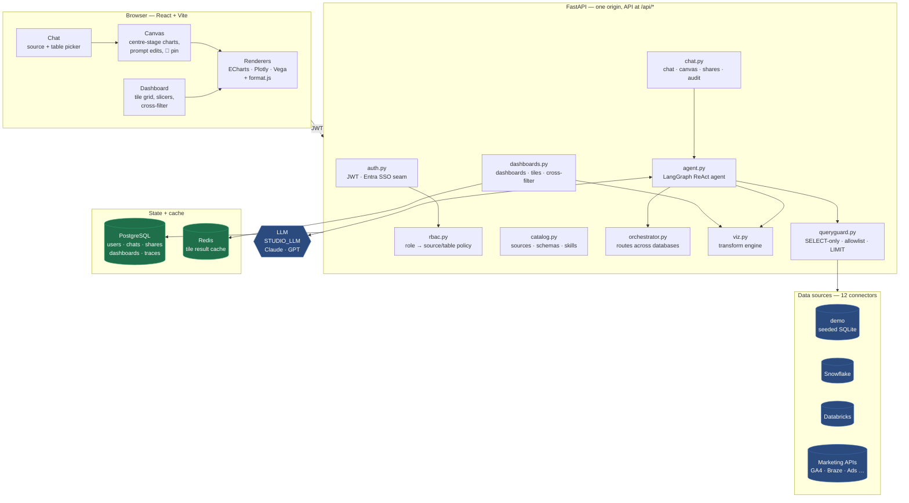
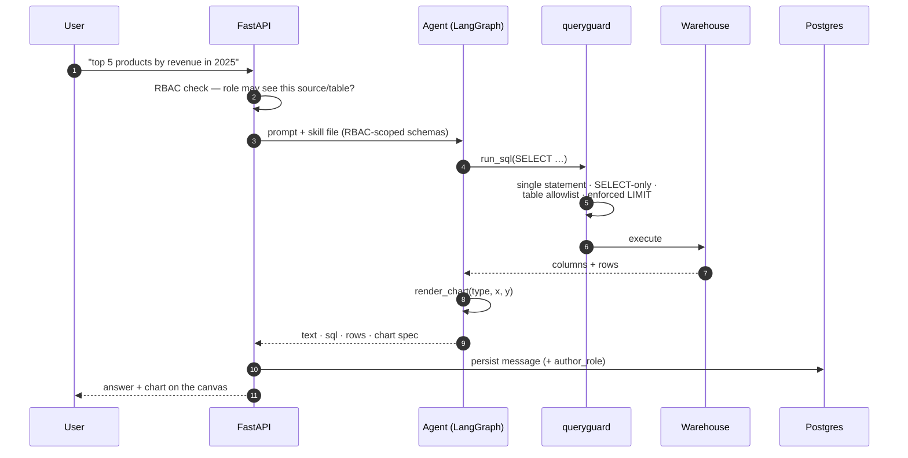
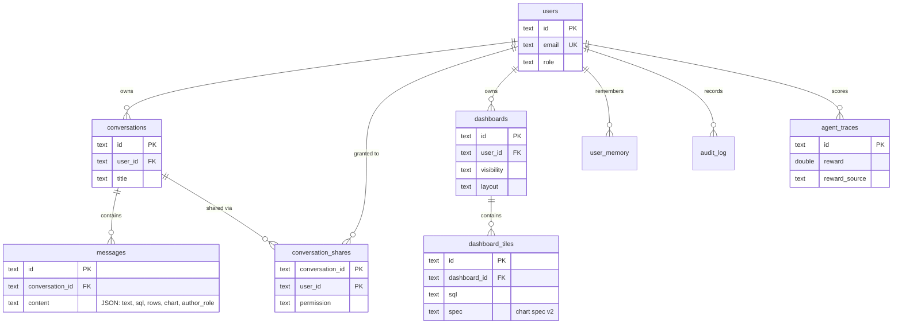
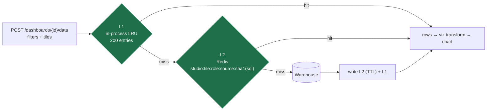
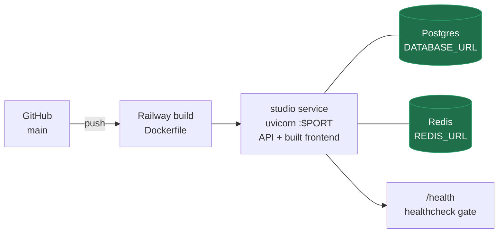

# Studio

Ask your data anything. A ChatGPT-style analytics studio: pick a data source,
ask a question in plain English — an agent writes the SQL, runs it (read-only,
RBAC-enforced), and renders the answer as Power BI / Tableau-class
visualizations you can pin to dashboards, cross-filter, and share.

**Live demo:** https://studio-production-ac35.up.railway.app

---

## Architecture



**Per-database agents.** Every source gets its own agent, briefed by an
auto-generated *skill file* (`skills.py`) listing only the tables the current
user's role may touch. The file carries a fingerprint of
`(dialect, allowed tables, schemas)` and rebuilds itself the moment a schema
or a role's access changes. An orchestrator exposes those agents as tools
(`ask_demo`, `ask_snowflake`, …) and routes each question — or fans it out when
one genuinely spans databases.

### How a question becomes a chart



Without an API key the agent degrades to a deterministic preview
(`SELECT * … LIMIT` + auto chart), so the whole flow stays demoable.

---

## Data architecture

State lives in **PostgreSQL** when `DATABASE_URL` is set, otherwise SQLite.
`db.py` wraps psycopg in a SQLite-shaped facade, so every statement is written
once and runs on both.



Two deliberate choices:

- **Dashboards store the recipe, never the rows.** A tile keeps its `sql` and
  chart `spec`; data is re-fetched per viewer, so RBAC is evaluated at *view*
  time rather than frozen at pin time.
- **Messages *do* store rows** (that is what makes a chat replayable), which is
  why sharing is an RBAC boundary — see [Security](#security-model).

> Postgres note: `REAL` there is float4 and would round a `time.time()` epoch to
> ~1.7858035e9, collapsing every `created_at`. The facade maps `REAL` →
> `DOUBLE PRECISION`.

### Caching



The **role is part of the cache key**, so two roles can never share rows, and
`queryguard` still runs on every request — the cache only skips the warehouse
round trip, never a permission check. Redis is optional: if `REDIS_URL` is
unset, or Redis is unreachable, it silently falls back to the in-process cache.
Values round-trip through JSON on a miss too, so cached and fresh reads hand
downstream transforms identically-typed values.

`GET /api/health` reports which backends are actually live:

```json
{ "status": "ok", "store": "postgres", "tile_cache": "redis",
  "llm": "anthropic:claude-sonnet-5", "agent": "ready" }
```

---

## Visualization

22 chart types across three engines (ECharts default, Plotly, Vega-Lite), with
a data-shape fit check that hides types the current result cannot support.

A single prompt drives the full **chart spec v2** — one merge patch covering
data *and* pixels:

| Layer | Where | What |
|---|---|---|
| `transform` | `viz.py`, server-side | calculated fields (sandboxed AST — no `eval`), quick table calcs (% of total, running total, rank, period-over-period, moving average), binning, date truncation, top-N with an "Other" bucket, filters, grouping |
| `format` | `format.js`, client-side | number/date/currency/percent formats, data labels, axis titles, legend, palettes, reference and target lines, conditional colours |

Stages run in a fixed order — `derive → bin → filters → unpivot → group →
having → table_calc → top_n → sort → pivot → limit` — so the model emits *what*,
never *when*. Unknown or partial fields degrade; they never blank a chart.

**Multiple charts from one sentence.** *"monthly, yearly and weekly trends as
one chart, and another at day level for this week"* returns a whole sheet: each
panel may carry its own `SELECT`, so a finer grain the current result already
aggregated away is re-queried (through the same guard and allowlist).

**Cross-filtering.** Clicking a bar becomes a server-side predicate applied to
every other tile — there is no JS predicate mirror, so filtering means the same
thing everywhere.

---

## Security model

- **RBAC** — roles (admin / analyst / viewer) map to sources and tables in
  `rbac.py`, enforced in the catalog, the query guard, and the agent's schema
  context. A viewer cannot see `customers` (PII) at all.
- **Query guard** — single statement, SELECT-only, forbidden-keyword scan,
  per-role table allowlist, enforced `LIMIT`.
- **Calculated fields** — a restricted AST evaluator: no attribute access, no
  calls outside an allowlist, and a hard cap on produced string size (nested
  `replace()` could otherwise expand 208 characters into 50 MB).
- **Sharing is an RBAC boundary.** Messages carry result rows, so a share could
  otherwise hand over data the recipient may never query. Enforcement happens
  when messages are **read**, not when the share is made, and keys off the
  *reader's* role — an owner gets no bypass. Since the stored `source`/`table`
  labels are client-supplied, every message is stamped server-side with its
  author's role and released only to a role at least as privileged. Hidden
  messages come back as a 🔒 placeholder, and the owner is told how many.
- **Conversation access** — one gate (`_own_or_404`) with `view` / `edit` /
  `owner` levels. A conversation you cannot see returns **404, never 403**, so
  the id space is not an existence oracle. Only owners delete or manage shares.
- **Auth** — email/password JWT, plus an Entra ID seam: the redirect flow and
  direct bearer-token validation against Microsoft's JWKS both converge on the
  same user record and RBAC.

---

## Deployment



A two-stage Dockerfile builds the frontend with Node, then serves it from
FastAPI alongside the API — one service, one origin, no CORS in production.
`railway.json` gates each deploy on `/health`.

---

## Run it

### Backend
```bash
cd backend
python3.12 -m venv .venv && source .venv/bin/activate
pip install -r requirements.txt
cp .env.example .env            # add ANTHROPIC_API_KEY or OPENAI_API_KEY
uvicorn app.main:app --reload --port 8000
```

### Frontend
```bash
cd frontend
npm install
npm run dev                      # http://localhost:5173 (proxies /api → :8000)
```

Or run it exactly as production does — `npm run build`, then start the backend
alone; FastAPI serves the built frontend on one origin.

### Demo logins
| Email | Password | Role | Sees |
|---|---|---|---|
| admin@studio.local | admin123 | admin | everything |
| analyst@studio.local | analyst123 | analyst | everything |
| viewer@studio.local | viewer123 | viewer | demo: sales, web_traffic only |

---

## Configuration

| Variable | Purpose |
|---|---|
| `STUDIO_LLM` | LangChain `init_chat_model` string — `anthropic:claude-sonnet-5`, `openai:gpt-4o`, … |
| `ANTHROPIC_API_KEY` / `OPENAI_API_KEY` | Key for whichever provider `STUDIO_LLM` names |
| `STUDIO_SECRET` | JWT signing secret — **must** be set in production |
| `DATABASE_URL` | Postgres; unset falls back to SQLite |
| `STUDIO_DB_PATH` | SQLite path — point at a mounted volume, or deploys wipe it |
| `REDIS_URL` | Tile cache; unset falls back to in-process |
| `STUDIO_DASH_CACHE_TTL` | Tile cache TTL in seconds (default 60) |
| `STUDIO_MODELS` | The model menu offered in the composer |
| `STUDIO_MCP_SERVERS` | JSON map of MCP servers exposed to the agent as extra tools |
| `AZURE_TENANT_ID` / `AZURE_CLIENT_ID` / `AZURE_CLIENT_SECRET` | Entra SSO |
| `AZURE_GROUP_ROLE_MAP` | Entra group → Studio role (highest wins) |

Warehouse credentials (`SNOWFLAKE_*`, `DATABRICKS_*`) and the marketing
connectors are listed in `backend/.env.example`; sources appear in the picker
automatically once configured.

---

## Roadmap
- Streaming agent steps to the UI (LangGraph `stream`)
- AAD-group → role mapping wired end to end
- Drill-through from a dashboard tile back into chat
- Scheduled dashboard email digests
