# Studio

An agentic analytics platform. Ask your data anything in plain English — a crew
of named agents writes the SQL, runs it (read-only, RBAC-enforced), and renders
Power BI / Tableau-class visualizations you can pin, cross-filter, and share.
Beyond chat it builds **verified SQL**, **prompt-driven pipelines** with data
lineage, a **safe-production pipeline flow** (generate → validate → approve →
deploy → run) with a human in the loop, **governance-as-code**, and a learning
loop (**Agent Lightning**) that records every run as a rewarded rollout. Once a
use case has been learned, a **self-hosted BitNet** — trained continuously from
those rollouts — takes over the recurring work, leaving the frontier LLM to
handle only what's genuinely new.

**Live demo:** https://studio-production-ac35.up.railway.app

---

## Architecture

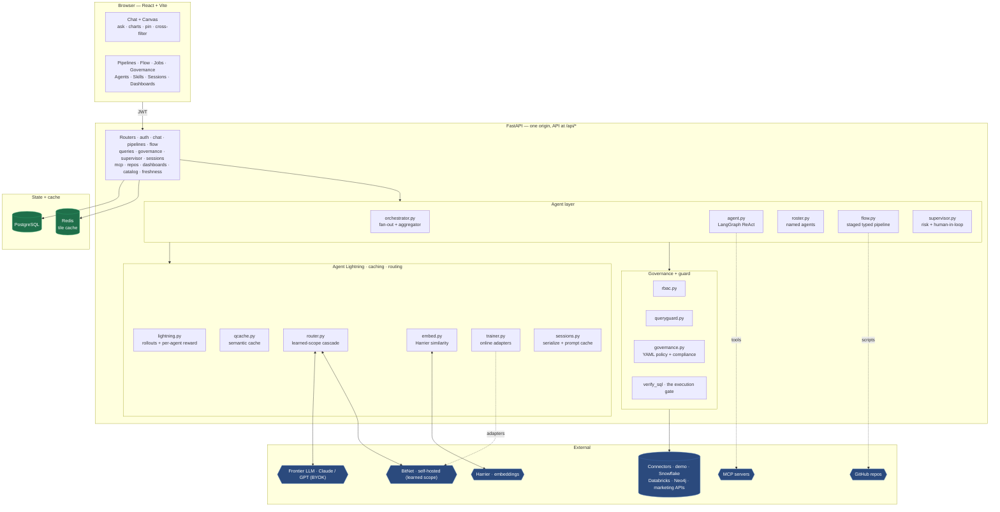

**One gate for data.** Every path that returns rows — the agent's `run_sql`
tool, the verified-SQL library, a pipeline step, the flow's Validator, a cache
hit — funnels through the same `verify_sql`: RBAC check → query guard → real
execution → governance compliance filter. There is no second way to reach the
warehouse, so a permission can never be skipped by taking a different route.

### How a question becomes a chart

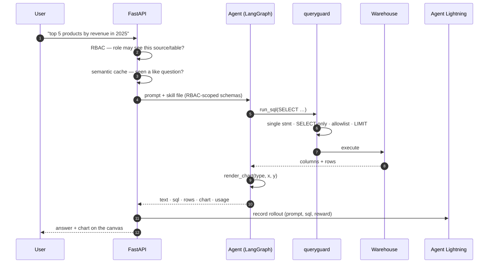

Without an API key the agent degrades to a deterministic preview
(`SELECT * … LIMIT` + auto chart), so the whole flow stays demoable. An
*invalid* key is a different case and is called out as one — "the server's key
was rejected; fix it or connect your own under ⚿ API keys" — instead of
pretending no key was set.

---

## Semantic layer — one definition of truth

Left to itself, the agent writes SQL from scratch for every question. That makes
"revenue" a moving target: two phrasings of the same question can compile to
different SQL and return *different numbers*, and nobody can say how any figure
was computed. That's the classic self-serve-analytics failure — the numbers are
fast but untrustworthy.

The **semantic layer** (`semantic.py`) fixes it. An admin defines each metric and
dimension **once**, in YAML:

```yaml
models:
  - source: demo
    table: sales
    metrics:
      - name: revenue
        agg: sum
        expr: revenue
        synonyms: [sales, turnover, income, earnings]
    dimensions:
      - name: region
        expr: region
        synonyms: [geography, area, market, location]
      - name: month
        expr: order_date
        grain: month              # truncated per the source's SQL dialect
        synonyms: [over time, monthly, trend]
```

Now a chat turn tries the semantic layer **first** (a tier ahead of the cache,
the BitNet router, and the frontier agent). A deterministic resolver maps the
prompt to defined metrics/dimensions (whole-word + light-stem synonym matching —
it never *force-fits*), and a dialect-aware compiler produces the one canonical
SQL. `revenue by region`, `sales across geographies`, `turnover by market`, and
`income by location` all resolve to the same metric+dimension and compile to
**byte-identical SQL → identical numbers**. Anything the layer can't resolve
returns nothing and falls through to the agent, untouched.

Because it's deterministic it needs **no model at all** — the governed metrics
work with no API key, and can't drift. And it decides only *what* to compute:
the compiled SQL still goes through `queries.verify_sql`, so **RBAC, the query
guard, and governance masking apply exactly as they do to any query**. The layer
never widens access.

The answer is labelled **▣ Semantic layer** in chat and carries its own
definition note ("revenue = SUM(revenue) · by region"), so a number is never a
black box. Admins edit the YAML under **▣ Semantic layer**; everyone can browse
the metric catalog and type a prompt to preview the exact SQL it compiles to
(`POST /semantic/compile`, no execution) — the consistency guarantee, made
inspectable.

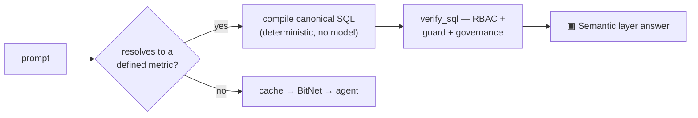

---

## The agent platform

### A named crew, not one model

Every connected source gets its own **worker agent**, briefed by an
auto-generated *skill file* (`skills.py`) that lists only the tables the current
user's role may touch. A cross-source question fans out to every accessible
worker and an **Aggregator** synthesizes their answers; a staged pipeline adds a
**Pipeline planner**, **Code generator**, **Validator**, **Approval agent**, and
a **Deployment executor**; the verified-SQL path is served by a **SQL verifier**.
`roster.py` gives each a stable name, so every answer reports which agent(s) ran
and each rollout is attributed to them.

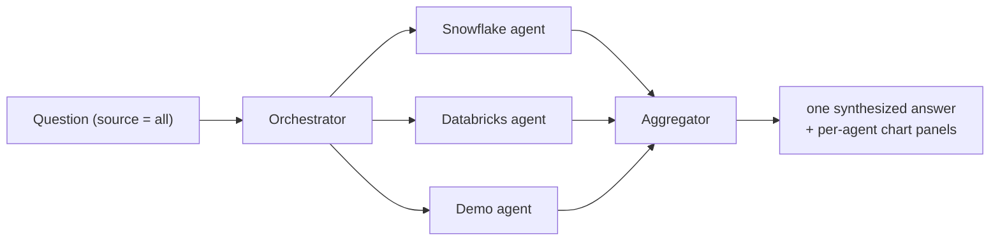

The skill file carries a fingerprint of `(dialect, allowed tables, schemas)` and
rebuilds itself the moment a schema or a role's access changes — the **Skill
files** view shows exactly what each agent knows.

### Verified SQL library

The agent writes SQL; a user can edit it, **verify** it (RBAC + guard + real
execution), and only then save it with the requirement prompt that produced it.
Verification is a hard gate — a query that doesn't run is never stored, and
re-running a saved query re-validates against the *runner's* role, so the
library can never become an RBAC bypass.

### Data freshness — "as of when"

Studio reads live data on every question, but it doesn't own the warehouse's
ingestion (dbt / Fivetran / Airflow do). It answers *"how current is this?"*
from what each table records about itself: `freshness.py` detects the best
freshness column — a load/ingest stamp (`loaded_at`, `snapshot_date`, `_ts`)
beats a business date, time-*typed* columns beat date-*named* ones (TEXT dates
are common) — and reads `MAX(col)` + row count through the same query guard +
RBAC allowlist as everything else. Load stamps and record dates are labeled
distinctly: *when the pipeline last wrote* vs *the newest business date
present*. Surfaced three ways: a `data_freshness` agent tool (ask "as of when
is this data current?" in chat), a 🕒 button per source in the **Skill files**
panel, and `GET /freshness/{source}`. Honest limit: it reports what's *in* the
tables — a silently failed pipeline shows up as a freshness value that stops
advancing, not as a schedule alert.

### Prompt-built pipelines + data lineage

Describe a job; the **Pipeline planner** routes it to the source whose tables
best match, drafts an ordered set of **verified** steps, and can pick the right
**GitHub repo** (`repos.py`) whose scripts fit the prompt. A pipeline renders a
**source → table → step lineage diagram** so a multi-source request shows
exactly where each table comes from; a failed step emails the requester naming
the failing source/table, and every run is traced through Agent Lightning.

### The staged flow — safe production behavior

`flow.py` turns one business request into a chain where **each stage is a named
agent that emits a typed JSON contract**, and each is recorded as a rollout:

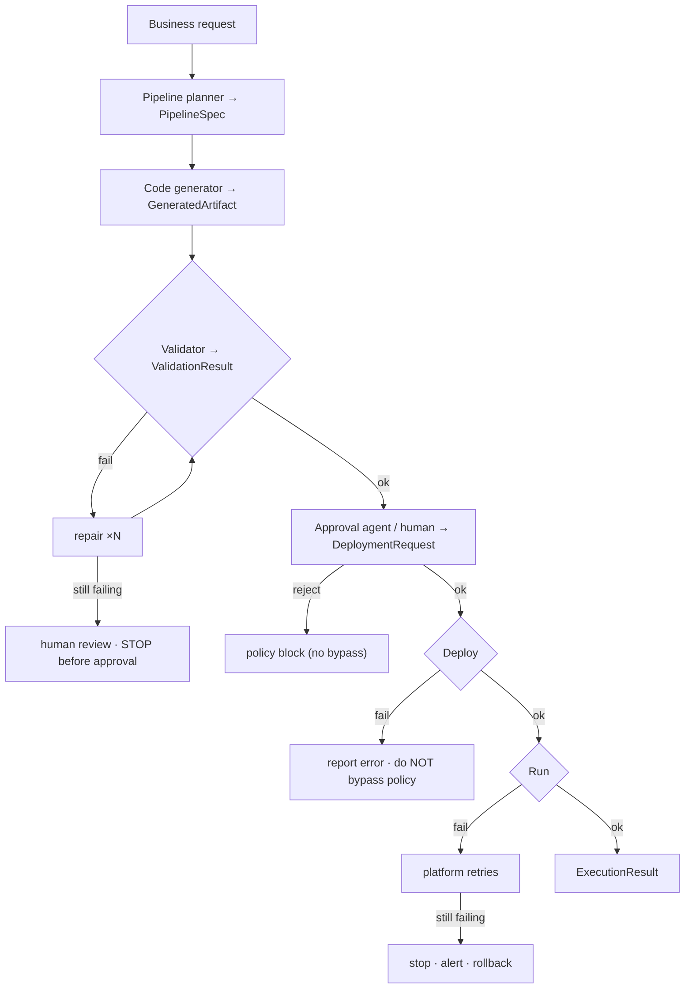

Read-only deployments run through; writes and Spark jobs hit the human-approval
gate. Deploy and Run are distinct phases — a deploy error is reported and never
bypasses policy; a run that keeps failing after the platform's retries is
stopped, the requester is alerted, and the deployment is rolled back
(best-effort, via an opt-in connector `rollback` hook).

### Supervised execution + human-in-the-loop

Studio is read-only by default. Running a script or Spark job against a real
environment passes a **supervisor agent** (`supervisor.py`): read-only
statements auto-approve; writes, DDL, and jobs require a human (admin) to
approve before anything runs. Execution failures retry, then escalate — the
requester is emailed and an admin approves a retry or aborts. Studio *generates*
Python but never executes arbitrary code itself; running always goes through
this gate.

### Governance-as-code

One YAML document (`governance.py`) owns per-role source/table access **and**
per-table compliance (deny columns, mask columns, row caps). Validate, then
apply — it hot-reloads with no redeploy and is enforced at every `run_query`
exit, so even `SELECT *` can't leak a denied column. Clearing it reverts to
built-in RBAC.

### Extending the agent — MCP, Build Python, graph DBs

Register **MCP servers** (`mcp.py`) exposing your existing scripts or internal
tools and agents pick them up automatically. **Build Python** (`pybuild.py`)
drafts a module in the style of your existing scripts using that MCP context.
A **Neo4j / Cypher** connector (`graph_conn.py`) sits behind the same interface.

---

## Agent Lightning — the learning loop

Modeled on Microsoft's [Agent Lightning](https://github.com/microsoft/agent-lightning):
every run becomes a **rollout** (prompt → actions → outcome) with a **reward**,
persisted to the `agent_traces` table.

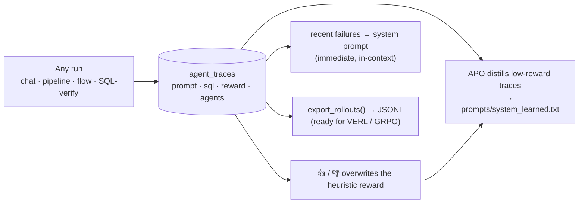

**Is it reinforcement learning?** Yes in structure, no in the usual sense. The
rollout + reward machinery *is* RL. But Studio runs on hosted models (Claude /
GPT) whose weights are frozen, so it can't do gradient/weight RL. Instead it
optimizes the **prompt** — recent failures injected in-context (immediate) and
APO distilling low-reward traces offline (RLAIF-style). The traces export in the
exact shape a real RL trainer consumes, so the day a self-hosted open-weight
model is added, the same rewarded data drives true weight RL — nothing about
collection changes.

**Per-agent reward shaping.** Each named agent is scored on its *own* decision,
not a blended answer-level reward: a worker on grounded SQL + rows + a real
chart, the aggregator on genuine synthesis, each flow stage on its own artifact,
the SQL verifier on whether its check ran. So the orchestrated crew produces a
per-worker rollout plus an aggregator rollout, and the `/learning` tally counts
only single-agent rollouts — no agent's average is smeared by another's work.
Each agent's reward + rollout count shows on its card in the **Agents** panel.

**Train our own model.** `GET /training` reports prompts collected vs. a
threshold, reward-labeled and human-rated counts, and readiness; the admin
**Agents** panel shows the progress bar. `POST /training/export` writes the
rollout JSONL — the bridge to the self-hosted BitNet path below.

---

## Self-hosted BitNet — learned-scope routing + simultaneous training

The frontier LLM (Claude / GPT) is the *frontier of what's new*; recurring,
learned work moves to a cheap, self-hosted **BitNet** whose **scope grows** over
time. Every prompt routes in three tiers, all keyed on *meaning* via Harrier:

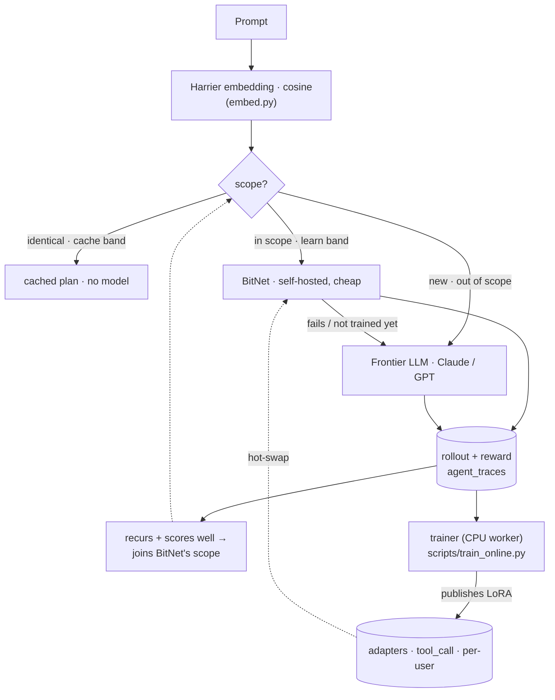

- **The scope grows, frontier usage shrinks.** A new prompt goes to the frontier
  LLM; its successful answers accumulate until that use case is *learned*
  (recurs, scores well) and joins BitNet's scope — future variations then route
  to BitNet, and only genuinely new contexts reach the frontier (`router.py`).
- **Harrier defines "same meaning."** `embed.py` embeds prompts with
  `microsoft/harrier-oss-v1-0.6b` (1024-dim, instruction-prefixed queries,
  documents plain) and scores cosine similarity — so different-word paraphrases
  match. It falls back to lexical token-Jaccard when `HARRIER_EMBED_URL` is unset.
- **Centralized + access-gated.** The learned scope is shared across users —
  one user's repeated, successful patterns benefit everyone (seen/reward
  aggregate across roles) — but a requester routes to BitNet only when their role
  can access every table the pattern touches ("same access"). **RBAC governs data
  access regardless of which model decides**; BitNet's SQL passes the same guard.
- **Safe through the training lag.** If BitNet hasn't actually trained on a
  just-learned case yet, its attempt fails and *escalates to the frontier* —
  cheaper, never wrong.

**Simultaneous training** (`trainer.py` + `scripts/train_online.py`). Studio is
the concurrent **producer + adapter server**; a **CPU worker** is the trainer —
BitNet's 1-bit base is CPU-efficient and its LoRA adapters are small, so **no GPU
is required**. They run at the same time:

```
Studio agent ──rollouts──▶  trainer (CPU worker)  ──adapters──▶  Studio serving
  (produces)                (SFT → DPO → GRPO)                   (hot-swaps)
     ▲                                                                │
     └──────────────────── keeps serving with the newest ────────────┘
```

The trainer pulls reward-labeled rollouts (`GET /training/rollouts`), trains a
**global tool-calling** LoRA plus **per-user style** LoRAs, and publishes them
(`POST /training/adapters`); serving composes both per request and hot-swaps to
the newest version. `GET /training/online` reports the loop status and BitNet's
growing scope. The heavy ML deps live in `scripts/requirements-trainer.txt`
(kept out of the lean API image); run the worker via `scripts/Dockerfile.trainer`.
The whole path is **dormant until `STUDIO_LLM_BASE_URL` (BitNet) and
`HARRIER_EMBED_URL` (Harrier) are configured**, so it changes nothing on its own.

---

## Performance

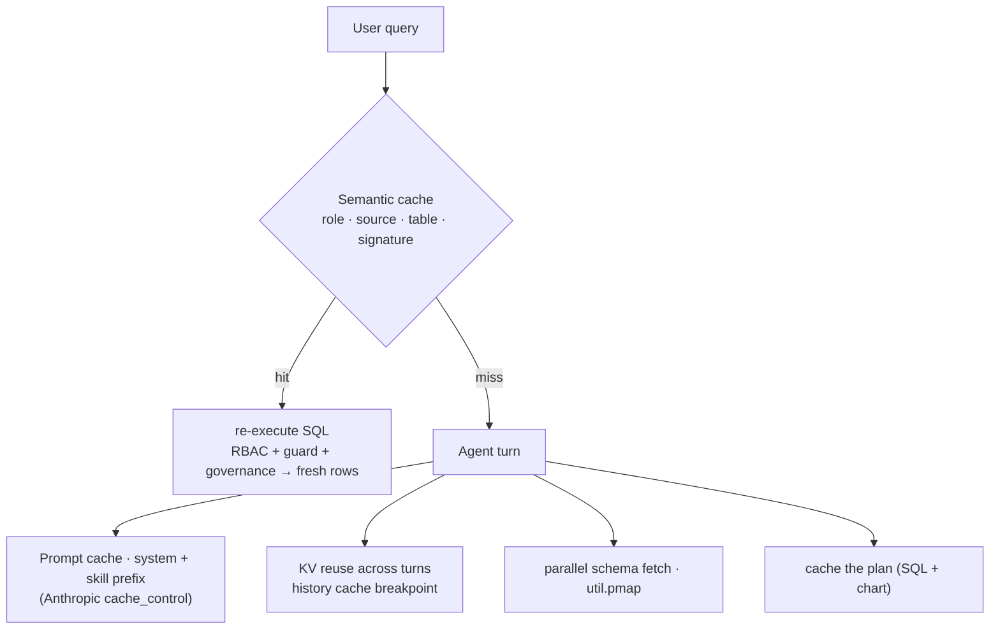

- **Independent I/O runs in parallel** (`util.pmap`) — per-source `list_tables`
  + schema fetches in the orchestrator, pipelines, and whole-source chat load
  concurrently, so latency is the slowest source, not their sum. (Agent tools
  stay sequential — they share the turn's context by design; the orchestrator
  fans agents out in parallel instead.)
- **Prompt caching** marks the large stable system/skill prefix with an
  Anthropic cache breakpoint — the provider keeps its KV cache warm and bills
  reads at ~10%.
- **KV reuse across conversation turns** marks the last prior-turn message with
  a second breakpoint, so each turn reuses the whole system + history prefix.
- **Semantic query cache** (`qcache.py`) caches a successful run's plan under a
  signature; a semantically-similar prompt reuses it but **always re-executes the
  SQL** through RBAC + guard + governance — fresh rows, access re-checked, never
  stale and never a bypass. Similarity uses Harrier embeddings when configured,
  lexical Jaccard otherwise (see the BitNet section).
- **Model cascade** (`router.py`) — learned, recurring work is served by the
  cheap self-hosted BitNet instead of the frontier LLM; only new use cases pay
  for the frontier. Full treatment in the [BitNet section](#self-hosted-bitnet--learned-scope-routing--simultaneous-training).

`usage` on each answer (input/output + cache-read/write tokens) makes the reuse
measurable.

---

## Sessions & concurrent tasks

- **Serialized agent sessions** (`sessions.py`) — every conversation is
  snapshotted with its model, scope, full transcript, and a hashed cacheable
  prefix, so a run can be paused, **resumed**, or **forked**; token + cache-read
  meters show the reuse.
- **Background tasks + blue dot** — `POST /chat/background` runs a turn in a
  worker pool and returns immediately, so you can start a question in one chat,
  switch to another and start a different one, and a **blue dot** lights up each
  conversation when its task finishes (cleared when opened).
- **Refresh-proof UI** — a browser refresh restores the open conversation (with
  its charts, and a still-running task's live state) and any unsent composer
  draft, both kept per user. History itself always lives server-side in
  Postgres — the refresh only ever risked the *view*, and now not even that.

---

## Visualization

22 chart types across three engines (ECharts default, Plotly, Vega-Lite), with a
data-shape fit check that hides types the current result can't support. A single
prompt drives the full **chart spec v2** — one merge patch over data *and* pixels:

| Layer | Where | What |
|---|---|---|
| `transform` | `viz.py`, server-side | calculated fields (sandboxed AST — no `eval`), table calcs (% of total, running total, rank, period-over-period, moving average), binning, date truncation, top-N with an "Other" bucket, filters, grouping |
| `format` | `format.js`, client-side | number/date/currency/percent formats, data labels, axis titles, legend, palettes, reference/target lines, conditional colours |

Stages run in a fixed order — `derive → bin → filters → unpivot → group → having
→ table_calc → top_n → sort → pivot → limit` — so the model emits *what*, never
*when*. **Multiple charts from one sentence**: each panel may carry its own
`SELECT`, so a finer grain the current result aggregated away is re-queried
through the same guard. **Cross-filtering** is a server-side predicate applied to
every tile — no JS mirror, so filtering means the same thing everywhere.
**Live cell edits update charts in place** — the ECharts instance persists
across data changes, so an edit moves one value instead of re-running the
entrance animation on the whole chart.

---

## Data architecture

State lives in **PostgreSQL** when `DATABASE_URL` is set, otherwise SQLite.
`db.py` wraps psycopg in a SQLite-shaped facade, so every statement is written
once and runs on both.

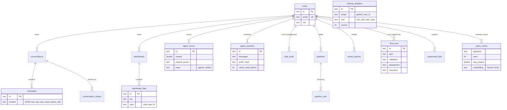

Alongside these: `governance_docs`, `mcp_servers`, `github_repos`, `chat_tasks`,
`training_adapters` — each a small table with a TEXT-uuid primary key (Postgres
has no implicit autoincrement, and a `REAL` epoch would round; the facade maps
`REAL → DOUBLE PRECISION`). `query_cache` doubles as the semantic cache and
BitNet's learned-scope repertoire (repetition + reward + Harrier embedding).

Warehouse connectors coerce every result cell to JSON-safe values
(`base.to_jsonable`: dates/times → ISO strings, `Decimal` → numbers so numeric
columns stay numeric for charts, bytes → text, nested structs recursed). Real
warehouses return Python objects SQLite never did, and both the API response
and the Redis tile-cache round-trip need plain JSON — this surfaced as a real
production bug the day Databricks was connected.

**Two deliberate choices:** dashboards and saved queries store the **recipe**
(SQL + spec), never rows, so RBAC is evaluated at *view* time; messages **do**
store rows (that is what makes a chat replayable), which is exactly why sharing
is an RBAC boundary enforced at read time.

### Tile cache

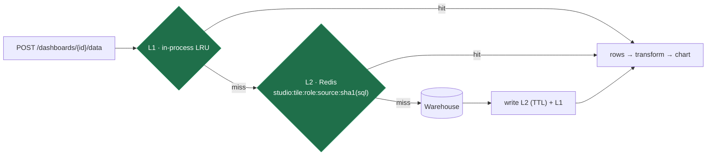

The **role is part of the cache key**, so two roles never share rows, and
`queryguard` still runs on every request — the cache only skips the warehouse
round-trip, never a permission check. Redis is optional and falls back to the
in-process cache silently.

---

## Security model

- **RBAC** — roles (admin / analyst / viewer) map to sources and tables in
  `rbac.py` (or the governance YAML), enforced in the catalog, the query guard,
  and the agent's schema context. A viewer cannot see `customers` (PII) at all.
- **Query guard** — single statement, SELECT-only, forbidden-keyword scan,
  per-role table allowlist, enforced `LIMIT`.
- **Read-only by default** — writes / DDL / Spark jobs only run through the
  supervisor + human approval; Studio never executes arbitrary Python.
- **Compliance filter** — governance strips denied columns, masks masked ones,
  and caps rows at every result exit — even `SELECT *` can't leak a denied field.
- **Sharing is an RBAC boundary** — messages carry rows, so enforcement happens
  when messages are **read**, keyed off the *reader's* role (an owner gets no
  bypass). Messages are stamped server-side with the author's role and released
  only to a role at least as privileged; hidden ones return a 🔒 placeholder.
- **No existence oracle** — a resource you cannot see returns **404, never 403**
  (`_own_or_404` everywhere), so the id space can't be probed.
- **Admin-only surfaces** — governance, the MCP + GitHub-repo registries, job
  approval, learning stats, and training readiness are all admin-gated.
- **Auth** — email/password JWT, plus an Entra ID seam (redirect flow + bearer
  validation against Microsoft's JWKS) converging on the same user + RBAC.

---

## Tradeoffs — why we chose this

| Decision | Why | Tradeoff accepted |
|---|---|---|
| **Hosted LLMs (Claude / GPT) via BYOK**, not self-hosted weights | No GPU fleet; users bring their own key; always the latest models | Can't do gradient/weight RL — learning is prompt-level |
| **Agent Lightning optimizes the prompt for hosted models; weights for BitNet** | Hosted weights are frozen (prompt-opt only); a self-hosted BitNet's *are* trainable from the same rollouts | Two learning modes to reason about — but the rollout data is identical |
| **BitNet serves the learned scope, frontier serves the new** (scope grows) | Recurring work shouldn't keep paying the frontier; the frontier bootstraps data and handles novelty | Runs two models; needs a BitNet + Harrier endpoint stood up; a training lag (covered by escalation) |
| **Learned scope centralized + access-gated** | One user's learned patterns benefit everyone with the same access | The *cache* tier stays role-scoped (it reuses stored insight text) — only the routing is centralized |
| **BitNet / LoRA trains on CPU** (no GPU) | 1-bit base + small adapters are CPU-feasible; deployable without a GPU fleet | Coarser (batch) cadence than a GPU; trainer's heavy deps live in a separate worker image |
| **Prompt/KV caching via provider `cache_control`** | Hosted APIs don't expose the raw attention KV cache | You cache the *prefix* (server-side, TTL-bound), not tensors |
| **Semantic cache re-executes the SQL** (never returns stored rows) | Fresh data + RBAC/guard/governance re-checked on every hit | A hit still pays the warehouse round-trip (but skips the LLM) |
| **Harrier embeddings when configured, lexical signature otherwise** | Real semantic match (different-word paraphrases) with Harrier; deterministic lexical fallback keeps it working offline with zero deps | Embeddings need a Harrier endpoint stood up; the lexical fallback misses different-word paraphrases |
| **Read-only by default; writes go through supervisor + a human** | An analytics tool must never silently mutate production | Every write is gated — latency and a human in the loop, by design |
| **Studio generates Python but never runs it** | Arbitrary code execution is the blast radius to avoid | Running requires the supervised Jobs path (an extra, deliberate step) |
| **Dashboards/queries store the recipe, not rows** | RBAC evaluated at view time, not frozen at pin time | Every view re-runs SQL (mitigated by the tile cache) |
| **Messages store rows** (replayable chat) | A chat has to render its past answers | Sharing becomes an RBAC boundary enforced at read time |
| **404, never 403**, for unauthorized resources | The id space must not be an existence oracle | Slightly less "helpful" errors — intentional |
| **Typed JSON contracts between flow stages** (Pydantic) | Explicit agent boundaries; every stage serializable + traceable | More ceremony than passing raw dicts |
| **Fail-fast flow + repair loop → human review** | A bad artifact must never reach approval or deploy | A borderline case a smarter model could fix still goes to a human |
| **Parallelize independent I/O, keep agent tools sequential** | Tools share the turn's context (`run_sql → render_chart` order matters) | No intra-turn tool parallelism — the orchestrator fans out across agents instead |
| **One SQLite-shaped facade over Postgres** | Write each statement once; runs on dev and prod | The facade must patch dialect gaps (`REAL → DOUBLE`, uuid PKs) |
| **Per-database agent + auto skill file** | RBAC-scoped context — an agent only ever sees tables the role may touch | The skill file must rebuild on any schema/access change (fingerprinted) |
| **LangGraph provider-neutral ReAct** | Swap Claude ↔ GPT without touching the graph or tools | Bound to LangChain's abstractions |
| **Background tasks on a thread pool**, not a broker/queue | One service, no extra infra; survives navigation | No cross-process durability — a restart drops in-flight tasks |
| **Single Railway service** (API serves the built frontend) | One origin, no CORS, one deploy, one healthcheck | Frontend and backend scale together |

---

## Deployment

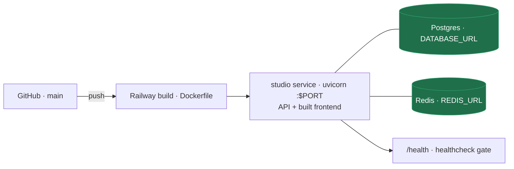

A two-stage Dockerfile builds the frontend with Node, then serves it from
FastAPI alongside the API — one service, one origin, no CORS in production.
`railway.json` gates each deploy on `/health`, which reports which backends are
live: `{ "store": "postgres", "tile_cache": "redis", "agent": "ready" }`.

---

## Run it

### Backend
```bash
cd backend
python3.12 -m venv .venv && source .venv/bin/activate
pip install -r requirements.txt
cp .env.example .env            # add ANTHROPIC_API_KEY or OPENAI_API_KEY
uvicorn app.main:app --reload --port 8000
```

### Frontend
```bash
cd frontend
npm install
npm run dev                      # http://localhost:5173 (proxies /api → :8000)
```

Or run it exactly as production does — `npm run build`, then start the backend
alone; FastAPI serves the built frontend on one origin.

### Demo logins
| Email | Password | Role | Sees |
|---|---|---|---|
| admin@studio.local | admin123 | admin | everything + governance, jobs, training |
| analyst@studio.local | analyst123 | analyst | everything (no admin surfaces) |
| viewer@studio.local | viewer123 | viewer | demo: sales, web_traffic only |

---

## Configuration

| Variable | Purpose |
|---|---|
| `STUDIO_LLM` | LangChain `init_chat_model` string — `anthropic:claude-sonnet-5`, `openai:gpt-4o`, … |
| `ANTHROPIC_API_KEY` / `OPENAI_API_KEY` | Key for whichever provider `STUDIO_LLM` names (users may also BYOK) |
| `STUDIO_SECRET` | JWT signing secret — **must** be set in production |
| `DATABASE_URL` | Postgres; unset falls back to SQLite |
| `STUDIO_DB_PATH` | SQLite path — point at a mounted volume, or deploys wipe it |
| `REDIS_URL` | Tile cache; unset falls back to in-process |
| `STUDIO_PROMPT_CACHE` | Toggle Anthropic prompt/KV caching (default on) |
| `STUDIO_QCACHE_THRESHOLD` | Cache-band similarity threshold (default 0.9) |
| `HARRIER_EMBED_URL` | Harrier embedding endpoint (OpenAI-compatible `/embeddings`); unset → lexical matching |
| `HARRIER_EMBED_MODEL` / `HARRIER_EMBED_INSTRUCT` / `HARRIER_EMBED_KEY` | Harrier model id (default `microsoft/harrier-oss-v1-0.6b`), query instruction, optional auth |
| `STUDIO_LLM_BASE_URL` / `STUDIO_BITNET_LLM` | Self-hosted BitNet endpoint + model spec for the learned-scope router |
| `STUDIO_TRAIN_THRESHOLD` | Prompts to collect before "ready to train" (default 500) |
| `STUDIO_MODELS` | The model menu offered in the composer |
| `STUDIO_MCP_SERVERS` | JSON map of MCP servers exposed to the agent as extra tools |
| `GITHUB_TOKEN` | Read private repos in the GitHub repo registry |
| `AZURE_TENANT_ID` / `AZURE_CLIENT_ID` / `AZURE_CLIENT_SECRET` / `AZURE_GROUP_ROLE_MAP` | Entra SSO + group→role mapping |

Warehouse credentials (`SNOWFLAKE_*`, `DATABRICKS_*`, `NEO4J_*`) and the
marketing connectors are listed in `backend/.env.example`; sources appear in the
picker automatically once configured. The Databricks driver ships installed
(set the three `DATABRICKS_*` vars and the source appears); Snowflake's is a
one-line uncomment in `requirements.txt`.

---

## Roadmap

**Shipped this cycle** (on `main`): object-storage (S3 / Azure / GCS) + BigQuery
connectors with the hardened guard; the **Pipeline Control Service** (Airflow /
Databricks Jobs / dbt Cloud / K8s-Spark behind the supervisor); the **semantic
layer** (one definition of truth per metric); a light **Microsoft-Fluent /
Data-Formulator** reskin with an encoding-shelf chart builder; the **pipeline-flow
visualization** (source → transforms → target, per-step pass/fail + email digest);
the **lakehouse write→read bridge** (S3 → Spark → S3 Parquet → auto-registered
dataset → viz); **Autopilot agents** (schedule / threshold / event / manual, act-
with-approval); and the self-hosted **BitNet** pipeline — the CPU **trainer**
(reward-filtered SFT + DPO), **source-conditioned** training (per-source
schema/dialect), and the **serving unit** (adapter-aware gateway + vLLM/BitNet.cpp).

### Future rollouts

**Scale-out with Ray** (a scale-out upgrade — the single-node CPU path stays the
default; not needed at today's volume, adopt when data/QPS justify a cluster):
- **Ray Data** — distributed, streaming data feed for training: pull rollouts,
  condition, tokenize, mine DPO pairs in parallel across workers (our per-rollout
  transforms are already pure, so they map cleanly). The answer to "feed lots of
  ever-changing data to BitNet."
- **Ray Train** — data-parallel LoRA training that wraps the existing `trl`
  SFT/DPO trainers across GPUs/nodes for throughput.
- **Ray Serve** — autoscaling vLLM replicas behind the serving gateway (the
  30k-seat serving path); pairs with the durable-queue lift below.
- **Ray Core** — parallel **best-of-N** on-policy sampling (below) and the
  parallel eval-gate.

**BitNet / RL learning loop:**
- **On-policy best-of-N preference generation** — sample N completions per prompt
  from the current policy, score + pair them, so DPO/GRPO have real preference
  data (the passive rollout log yields ~0 pairs today; verified against prod).
- **Eval-gate / shadow promotion** — promote a freshly trained adapter to
  `active` only if it beats the current one on a holdout, instead of publish=live.
- **Full train≈serve fidelity** — condition each sample on the rollout's own role
  and reproduce the complete serving system-prompt wrapper (today: skill sub-block
  only, guard-covered).
- Decision-level (per-tool-call) rollouts for finer-grained training data.

**Platform / scale:**
- **Durable-queue lift** — move background agent-runs + the autopilot ticker onto
  a Redis/RQ queue so they scale past a single instance (task state is already in
  Postgres; only the executor is per-pod today).
- Route the pipeline flow's `deploy_execute` through the real platform adapters
  per target (currently via `supervisor.submit`).

**Product:**
- **Blend into chat** — the cross-source blend engine is built + tested; wire the
  Fields/encoding picker into the chat UI.
- **Data Threads** — the branching exploration history to complete the Data
  Formulator reshell.
- CPU adapter hot-swap (auto PEFT→GGUF convert), streaming agent steps to the UI,
  dashboard drill-through, scheduled dashboard email digests.
